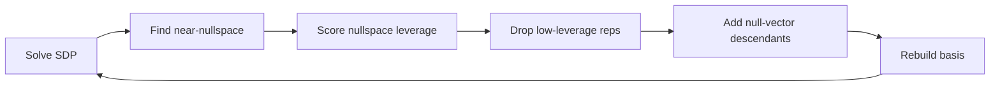

### *1. Primal and dual SDPs*
The standard primal semidefinite program is
$$
    \min_X\ \operatorname{Tr}(CX)
    \quad \text{subject to}\quad X\succeq 0;\quad \operatorname{Tr}(A_i X)=b_i,\ i=1,\dots,m.
$$
Note that
* $X$ is the positive semidefinite matrix variable.
* $C$ defines the linear objective.
* $A_i$ define affine equality constraints.
* $b_i$ are known constants.

Geometrically, the feasible set is the intersection of the PSD cone with affine hyperplanes. The primal problem minimizes a linear functional over this convex set.

Introduce one dual variable $y_i$ for each affine equality constraint. The dual problem is
$$
    \max_y\ \sum_{i=1}^m b_i y_i
    \quad\text{subject to}\quad S = C - \sum_{i=1}^m y_i A_i \succeq 0.
$$
The matrix $S$ is the dual slack matrix. *Weak duality* states that for any primal-feasible $X$ and dual-feasible $y$, the feasible dual value is a rigorous lower bound on feasible primal energy. Consider
$$
\begin{aligned}
    \operatorname{Tr}(CX)
    &= \operatorname{Tr}\left[\left(S+\sum_i y_i A_i\right)X\right] \\[5pt]
    &= \operatorname{Tr}(SX)+\sum_i y_i\operatorname{Tr}(A_iX) \\[5pt]
    &= \operatorname{Tr}(SX)+\sum_i b_i y_i.
\end{aligned}
$$
Since $S\succeq 0$ and $X\succeq 0$,
$$
    \operatorname{Tr}(SX)\ge 0.
$$
Therefore it is proved that
$$
    \operatorname{Tr}(CX)\ge \sum_i b_i y_i.
$$

Under regularity assumptions such as Slater-type interior feasibility, the primal and dual optimal values coincide (*strong duality*),
$$
    \operatorname{Tr}(CX^*) = \sum_i b_i y_i^*.
$$
Combining this with the weak-duality identity gives
$$
    \operatorname{Tr}(S^*X^*)=0.
$$
This is *complementary slackness*. Since both $S^*$ and $X^*$ are positive semidefinite, their supports are orthogonal. Directions where the dual slack matrix has positive eigenvalue must be null directions of the primal moment matrix.

In bootstrap language:
* $X^*$ is the optimal moment matrix.
* $S^*$ is the optimal dual certificate or sum-of-squares matrix.
* Null vectors of $X^*$ correspond to null operators on the putative ground state.
* Positive directions of $S^*$ identify algebraic directions excluded by the dual certificate.

This is the formal reason dual certificates and primal null spaces are useful for active-set style pruning and growth.

Refs:
* https://people.eecs.berkeley.edu/~elghaoui/Teaching/EE227A/lecture11.pdf
* https://www.cs.cmu.edu/afs/cs.cmu.edu/academic/class/15859-f11/www/notes/lecture12.pdf

### *2. Many-body bootstrap problem*
We formulate the many-body bootstrap problem first in terms of primal SDP:
$$
\begin{aligned}
    &\min_\mathbf{x}\ \langle \mathcal{H}\rangle = \mathbf{c}^T \mathbf{x}\\[5pt]
    &\text{subject to}\quad M(\mathbf{x})\succeq 0;\quad A\mathbf{x}=\mathbf{b}.
\end{aligned}
$$
Let $\mathbf{x}$ be the vector of independent expectation values of the operator algebra. The elements $M_{ij}$ are linear combinations of these expectation values: $M(\mathbf{x})=\sum_k x_k M^{(k)}$, where $M^{(k)}$ are constant symmetric (or more generally hermitian) matrices defining the algebraic structure.

#### *2.1. Lagrangian dual problem*
The clues of constructing the dual problem come from the Lagrangian. Introduce multipliers:
* A vector $\boldsymbol{\lambda}$ for the affine constraints $A\mathbf{x}=\mathbf{b}$.
* A PSD matrix $Y\succeq 0$ for the moment-matrix constraint $M(\mathbf{x})\succeq 0$.

Use the Lagrangian
$$
    L(\mathbf{x},\boldsymbol{\lambda},Y)
    = \mathbf{c}^T\mathbf{x}
    - \boldsymbol{\lambda}^T(A\mathbf{x}-\mathbf{b})
    - \operatorname{Tr}\left[Y M(\mathbf{x})\right].
$$
For any primal-feasible $\mathbf{x}$, $A\mathbf{x}=\mathbf{b}$ and $M(\mathbf{x})\succeq 0$. Therefore
$$
    L(\mathbf{x},\boldsymbol{\lambda},Y) \le \mathbf{c}^T\mathbf{x}.
$$
So for fixed $(\boldsymbol{\lambda},Y)$, define the dual function
$$
    g(\boldsymbol{\lambda},Y)
    = \inf_\mathbf{x} L(\mathbf{x},\boldsymbol{\lambda},Y).
$$
Here the infimum is taken over all moment vectors $\mathbf{x}$, not only over primal-feasible ones. Hence for any feasible $\mathbf{x}_{\mathrm{feas}}$,
$$
    g(\boldsymbol{\lambda},Y)
    \le L(\mathbf{x}_{\mathrm{feas}},\boldsymbol{\lambda},Y)
    \le \mathbf{c}^T\mathbf{x}_{\mathrm{feas}}.
$$
Since this holds for every feasible $\mathbf{x}_{\mathrm{feas}}$, it also holds after minimizing over all feasible points:
$$
    g(\boldsymbol{\lambda},Y)
    \le
    \min_{\mathbf{x}:\ A\mathbf{x}=\mathbf{b},\ M(\mathbf{x})\succeq 0}
    \mathbf{c}^T\mathbf{x}.
$$
Thus each fixed pair $(\boldsymbol{\lambda},Y)$ gives one certified lower bound on the primal optimum. The dual problem is to choose $(\boldsymbol{\lambda},Y)$ so that this lower bound is as large as possible.

Now minimize the Lagrangian over the unconstrained moment vector $\mathbf{x}$. Since $M(\mathbf{x})$ is linear in $\mathbf{x}$, the Lagrangian is also linear in $\mathbf{x}$. Its infimum is finite only if all $\mathbf{x}$-dependent terms cancel. At the $M(\mathbf{x})$ level, this cancellation condition is the identity
$$
    \forall\ \mathbf{x}, \quad
    \mathbf{c}^T\mathbf{x}
    = \boldsymbol{\lambda}^T A\mathbf{x}
    + \operatorname{Tr}\left[Y M(\mathbf{x})\right].
$$
This is equivalent to
$$
    c_k = \left(A^T\boldsymbol{\lambda}\right)_k + \operatorname{Tr}\left[Y M^{(k)}\right], \quad k=1,\dots,n.
$$
When this identity holds, the Lagrangian reduces to the constant $L(\mathbf{x},\boldsymbol{\lambda},Y) = \boldsymbol{\lambda}^T\mathbf{b}$,
so
$$
    g(\boldsymbol{\lambda},Y)=\boldsymbol{\lambda}^T\mathbf{b}.
$$
Thus the dual bootstrap problem is
$$
\begin{aligned}
    &\max_{\boldsymbol{\lambda},Y}\quad
    \boldsymbol{\lambda}^T\mathbf{b}\\[5pt]
    &\text{subject to}\quad
    Y\succeq 0;
    \quad c_k = \left(A^T\boldsymbol{\lambda}\right)_k + \operatorname{Tr}\left[Y M^{(k)}\right].
\end{aligned}
$$
For any feasible bootstrap moment vector $\mathbf{x}$, the same identity gives
$$
\begin{aligned}
    \mathbf{c}^T\mathbf{x}
    &= \boldsymbol{\lambda}^T A\mathbf{x}
    + \operatorname{Tr}\left[Y M(\mathbf{x})\right] \\[5pt]
    &= \boldsymbol{\lambda}^T\mathbf{b}
    + \operatorname{Tr}\left[Y M(\mathbf{x})\right] \\[5pt]
    &\ge \boldsymbol{\lambda}^T\mathbf{b}.
\end{aligned}
$$
Therefore $\boldsymbol{\lambda}^T\mathbf{b}$ is the certified energy lower bound.

> Primal world and dual certificate:
>
> The primal solution gives a candidate moment assignment $\mathbf{x}^*$, i.e. possible expectation values of operators in the truncated bootstrap algebra. From it one can reconstruct the optimal moment matrix $M(\mathbf{x}^*)$. This object behaves like a relaxed density matrix: it need not come from an exact physical wavefunction, but it must satisfy all imposed positivity, symmetry, normalization, filling, and Ward constraints.
>
> The dual solution gives a certificate of the lower bound. It consists of affine multipliers $\boldsymbol{\lambda}^*$ and a PSD matrix $Y^*\succeq 0$ such that the Hamiltonian objective is decomposed into exact constraints plus a positive semidefinite (SOS) term. Therefore it proves that every feasible moment assignment has energy at least $\boldsymbol{\lambda}^{*T}\mathbf{b}$.
>
> Thus the primal solution is a possible optimal world of moments, while the dual solution is a proof that no feasible world can have lower energy. When strong duality holds, these two descriptions meet at the same optimal value.
>
> In numerical SDP solvers, the primal and dual solutions are usually computed together. For example, an interior-point solver evolves primal variables, dual variables, and slack variables simultaneously; first-order conic solvers such as SCS also report approximate primal and dual certificates. The solver does not only check the primal objective value. It typically monitors primal residuals, dual residuals, and the duality gap
> $$
>     \mathbf{c}^T\mathbf{x} - \boldsymbol{\lambda}^T\mathbf{b}.
> $$
> Small primal residual means the moment assignment nearly satisfies $A\mathbf{x}=\mathbf{b}$ and $M(\mathbf{x})\succeq 0$. Small dual residual means the certificate nearly satisfies $Y\succeq 0$ and $c_k=(A^T\boldsymbol{\lambda})_k+\operatorname{Tr}[YM^{(k)}]$. Small duality gap means the candidate moment world and the certificate prove essentially the same energy.
>
> The primal and dual optimal values converge to the same value when strong duality holds and the solver reaches sufficient numerical accuracy. A standard sufficient condition is a Slater-type interior point: roughly, there is a strictly feasible primal point with $M(\mathbf{x})\succ 0$ satisfying the affine constraints, and a strictly feasible dual certificate with $Y\succ 0$ satisfying the dual stationarity equations. In bootstrap problems this condition can be weakened or fail because symmetries and Ward identities often force exact null directions, but strong duality can still hold after restricting to the correct support. Numerically, one should therefore expect equality only up to solver tolerance.

#### *2.2. Dual operator identity*
Start from the dual identity obtained above:
$$
    \forall\ \mathbf{x}, \quad
    \mathbf{c}^T\mathbf{x}
    = \boldsymbol{\lambda}^T A\mathbf{x}
    + \operatorname{Tr}\left[Y M(\mathbf{x})\right].
$$
This identity is first a statement about linear functionals of the moment vector $\mathbf{x}$. To read it as an operator identity, identify the three pieces one by one.

* 
    First, the objective coefficients $\mathbf{c}$ encode the Hamiltonian in the chosen moment coordinates, and we have
    $$
        \mathbf{c}^T\mathbf{x}=\langle \mathcal{H}\rangle.
    $$

* 
    Second, the affine term is a linear combination of imposed exact constraints. It is often clearest to separate constraints into two classes:

    * the nonzero-RHS normalization constraint $\langle \mathcal{I}\rangle=1$;
    * zero-RHS constraints $\langle \mathcal{G}_\alpha\rangle=0$.

    Any known expectation-value constraint can be moved into the second class by subtracting its identity component. For example, fixed filling $\langle \mathcal{N}\rangle=n$ is equivalently written as $\langle \mathcal{N}-n\mathcal{I}\rangle=0$. Ward constraints are already zero-RHS constraints $\langle[\mathcal{C},\mathcal{O}_m]\rangle=0$. Thus the affine part can be written schematically as
    $$
        \boldsymbol{\lambda}^T A\mathbf{x}
        = \lambda_I\langle \mathcal{I}\rangle
        + \lambda_N\langle \mathcal{N}-n\mathcal{I}\rangle
        + \sum_m \lambda_m\langle[\mathcal{C},\mathcal{O}_m]\rangle.
    $$
    Here $\mathcal{C}$ can be the Hamiltonian for stationarity constraints, or a symmetry charge for Ward identities.

* 
    Third, the PSD term is the sum-of-squares (SOS) part. Let the bootstrap operator basis for the moment matrix be $\mathcal{S}=\{\mathcal{O}_1,\cdots,\mathcal{O}_N\}$, so that
    $$
        M_{ij}(\mathbf{x})=\langle \mathcal{O}_i^\dag \mathcal{O}_j\rangle.
    $$
    Since $Y\succeq 0$, write its spectral decomposition as
    $$
        Y=\sum_a y_a |v_a\rangle\langle v_a|, \quad y_a>0.
    $$
    Define
    $$
        \mathcal{P}_a=\sqrt{y_a}\sum_i (v_a)_i \mathcal{O}_i.
    $$
    Then
    $$
        \operatorname{Tr}\left[Y M(\mathbf{x})\right]
        = \sum_a \langle \mathcal{P}_a^\dag \mathcal{P}_a\rangle.
    $$
    $Y$ denotes the coefficients of SOS operators.

Note we use the convention where normalization is the only nonzero-RHS constraint, while fixed filling is written as the zero-RHS constraint $\langle\mathcal{N}-n\mathcal{I}\rangle=0$. Therefore the dual objective
$$
    E_{\mathrm{bound}}\overset{!}{=}\boldsymbol{\lambda}^T\mathbf{b}=\lambda_I.
$$
Thus the dual SDP can be read as maximizing the identity multiplier $\lambda_I$, while the other multipliers and the SOS matrix $Y$ determine whether that value is certifiable. As a result, in the zero-RHS convention, the dual identity can be read as the expectation-value identity
$$
    \langle \mathcal{H}\rangle
    = E_{\mathrm{bound}}\langle \mathcal{I}\rangle
    + \lambda_N\langle \mathcal{N}-n\mathcal{I}\rangle
    + \sum_m \lambda_m\langle[\mathcal{C},\mathcal{O}_m]\rangle
    + \sum_a \langle\mathcal{P}_a^\dag\mathcal{P}_a\rangle,
$$
where all terms after $E_{\mathrm{bound}}\langle \mathcal{I}\rangle$ are zero-expectation constraints or nonnegative SOS terms. Equivalently,
$$
    \mathcal{H} - E_{\mathrm{bound}}\mathcal{I}
    = \lambda_N(\mathcal{N}-n\mathcal{I})
    + \sum_m \lambda_m \left[\mathcal{C},\mathcal{O}_m\right]
    + \sum_a \mathcal{P}_a^\dag \mathcal{P}_a.
$$
This is an *operator identity* at the level of the truncated operator algebra. Variational dual variables include multipliers $\boldsymbol{\lambda}$ (such as $E_{\mathrm{bound}}=\lambda_I$, $\lambda_N$ and $\lambda_m$) and SOS operators $\mathcal{P}_a$. The dual SDP is therefore the problem of finding the largest scalar $E_{\mathrm{bound}}$ for which $\mathcal{H}-E_{\mathrm{bound}}\mathcal{I}$ can be represented as a linear combination of exact zero-expectation constraints plus an SOS operator.

For any feasible bootstrap moment assignment, the filling and Ward terms have zero expectation and the SOS term is nonnegative. This proves $\langle \mathcal{H}\rangle\ge E_{\mathrm{bound}}$. Strictly speaking, this is a projected identity in the current truncated bootstrap algebra, not necessarily an exact identity in the full operator algebra unless the chosen basis is closed under all generated terms.

#### *2.3. Complementary slackness*
For a certified optimal solution, we often expect the primal and dual values to meet up to numerical tolerance,
$$
    \langle \mathcal{H}\rangle^* \simeq E_{\mathrm{bound}}^*.
$$
Using the dual operator identity at the optimal dual point gives
$$
    \langle \mathcal{H}\rangle^* - E_{\mathrm{bound}}^*
    = \sum_a \left\langle \mathcal{P}_a^{*\dag}\mathcal{P}_a^* \right\rangle_{\mathbf{x}^*},
$$
where the filling and Ward terms vanish on the feasible primal moment assignment $\mathbf{x}^*$. If the duality gap is zero, or numerically very small, then
$$
    \left\langle \mathcal{P}_a^{*\dag}\mathcal{P}_a^* \right\rangle_{\mathbf{x}^*} \simeq 0.
$$
This is the bootstrap version of *complementary slackness*. In matrix form it says $\operatorname{Tr}\left[Y^*M(\mathbf{x}^*)\right]\simeq 0$. Since both $Y^*\succeq 0$ and $M(\mathbf{x}^*)\succeq 0$, this trace can vanish only when their positive supports are orthogonal. Equivalently, positive eigendirections of the dual SOS matrix $Y^*$ must lie in the nullspace of the primal moment matrix $M(\mathbf{x}^*)$,
$$
    \mathcal{P}_a^*\left|\psi^*_0\right\rangle \simeq 0.
$$
Thus each nonzero SOS operator $\mathcal{P}_a^*$ gives an approximate projected annihilator of the optimal bootstrap ground state. In the Gram matrix language, this means it contributes a zero direction of $M(\mathbf{x}^*)$. This is useful information because it identifies an algebraic relation saturated by the approximate ground state. (The ground state can be characterized by algebraic relations that annihilate it?)

A naive pruning step is to rotate the basis into null directions and remaining support directions,
$$
    \operatorname{span}\{\mathcal{O}_i\}
    = \operatorname{span}\{\mathcal{P}_a^*\}
    \oplus
    \operatorname{span}\{\mathcal{Q}_r\},
$$
and build the next SDP using the null directions $\mathcal{P}_a^*$, or equivalently restrict the moment matrix to the nullspace of $M(\mathbf{x}^*)$. This however makes the PSD constraints dense. In practice, we prune the representatitve basis based on its leverage in the nullspace.

#### *2.4. How to grow $\mathcal{S}$?*
Pruning alone does not usually improve the bootstrap bound. It removes representatives weakly involved in the current null relations, but the improvement comes from adding new operators to the PSD test space. A useful growth rule is to use the null operators discovered in the previous SDP. If
$$
    \mathcal{P}_a|\psi_0\rangle\simeq 0,
$$
then $\mathcal{P}_a$ can be viewed as an approximate projected ground-state equation. A true relation should not be isolated: it should generate further relations under Hamiltonian, symmetry, or local-operator actions. For example, if $\mathcal{H}|\psi_0\rangle=E_0|\psi_0\rangle$, then
$$
    [\mathcal{H},\mathcal{P}_a]|\psi_0\rangle \simeq 0.
$$
Similarly, for a simple local operator $\mathcal{A}$,
$$
    \mathcal{A}\mathcal{P}_a|\psi_0\rangle\simeq 0.
$$
Thus the descendants
$$
    [\mathcal{H},\mathcal{P}_a],\ 
    \mathcal{A}\mathcal{P}_a,\ 
    [\mathcal{C},\mathcal{P}_a]
$$
are natural objects to expand in the raw operator algebra. In practice one should not multiply by arbitrary operators. The local operator $\mathcal{A}$ should be chosen from simple terms near the support of $\mathcal{P}_a$, such as local Hamiltonian terms or symmetry generators. This keeps the growth near the algebraic boundary of the current null relation. The new low-complexity raw monomials appearing in these descendants, but missing from the current basis, are good candidates to add to the next SDP.

These expansions reveal which raw operator directions are needed for the next SDP to test whether the previous null relation is self-consistent in a larger algebra. If the relation is physical, the enlarged SDP should make it more stable and reveal more of its closure. If it was a truncation artifact, the new descendant operators allow the next SDP to correct it: the old null direction may acquire nonzero norm, or it may disappear from the active dual certificate.

The active-set picture is therefore an iterative process
$$
    \text{solve}
    \rightarrow
    \text{prune}
    \rightarrow
    \text{grow}
    \rightarrow
    \text{solve}.
$$
After each solve, the primal nullspace and the dual SOS certificate propose approximate annihilating operators of the bootstrap ground state. Repeating the loop is a way to continually refine the candidate ground-state annihilators, i.e. towards the physical nullspace of ground state.

From the dual viewpoint, the same loop is also an iterative search for a better SOS certificate. When the basis is sufficiently strong, one hopes that the surviving stable $\mathcal{P}_a$ yield the true physical annihilators of the ground state. However, $\mathcal{P}_a^\dag$ is not automatically a strict excitation creation operator as $\mathcal{P}_a^\dag|\psi_0\rangle$ may not be an energy eigenstate. Therefore $\mathcal{P}_a^\dag$ should be viewed as an excitation-channel candidate, not automatically as a strict quasiparticle operator. In other words, the SOS certificate supplies candidate null relations, while the excitation problem lives on the remaining support.

### *3. Implementation of Nullspace-Guided Adaptive (NGA) algorithm*
The raw basis is a list of translation representatives,
$$
    \mathcal{S}=\{\mathcal{O}_\alpha\},
$$
and the PSD test space is built from their translation orbits. In momentum space, each momentum sector $k$ has its own PSD block
$$
    M_k(\mathbf{x})\succeq 0.
$$
In the NGA algorithm, $\mathcal{S}_t$ at step $t$ is dynamically pruned and grown based on the nullspace of current optimal $M_k(\mathbf{x}^\ast;t)$.

One iteration is:

1. **Solve the SDP given $\mathcal{S}_t$**.
   Obtain the optimal primal moment blocks $M_k(\mathbf{x}^\ast;t)$.

2. **Extract near-null directions.**
   Diagonalize each evaluated block,
   $$
       M_k(\mathbf{x}^*;t) v_{k,a}=\epsilon_{k,a} v_{k,a},
   $$
   and identify directions with $0\le \epsilon_{k,a}\lesssim \epsilon_{\mathrm{null}}$ as nullvectors. Each such vector defines an approximate annihilator to the approximate ground state with momentum $k$. In real space it is expanded as
   $$
       \mathcal{P}_{k,a}
       = \sum_\alpha (v_{k,a})_\alpha \frac{1}{L_\alpha} \sum_r e^{-ikr}\, \mathcal{T}_r\mathcal{O}_\alpha,
   $$
   where $L_\alpha$ is the translation orbit period.

3. **Score operators $\mathcal{O}_\alpha$ by nullspace leverage.**
   For each representative $\mathcal{O}_\alpha$, accumulate its weight in the retained null space across all momentum sectors. Schematically,
   $$
       \ell_\alpha
       = \frac{1}{L_\alpha}
       \sum_k \sum_a |(v_{k,a})_\alpha|^2.
   $$
   Low $\ell_\alpha$ means $\mathcal{O}_\alpha$ participates weakly in the currently binding null relations.

4. **Drop low-leverage representatives.**
   The identity and Hamiltonian terms are protected. Other representatives with $\ell_\alpha$ below a threshold are drop candidates. To avoid overly aggressive replacement, the number of dropped representatives per step is capped.

5. **Generate growth candidates from null-operator descendants.**
   For each null operator $\mathcal{P}_{k,a}$, compute
   $$
       [\mathcal{H},\mathcal{P}_{k,a}],
   $$
   expand it in the raw operator algebra, canonicalize by translation, and collect missing representatives. Descendant growth is capped by
   $$
       \#\mathrm{grow} - \#\mathrm{drop} \le \Delta_{\max}.
   $$
   If too few new descendants are found, undo the weakest tentative drops until
   $$
       \#\mathrm{grow} - \#\mathrm{drop} \ge \Delta_{\min}.
   $$
   Dropped representatives at the same step are not allowed to be re-added, but they may re-enter in later iterations.

6. **Update $\mathcal{S}_{t+1}$ and resolve.**

This yields an adaptive replacement rule:

Its physical interpretation is that the primal near-nullspace proposes approximate ground-state annihilators, while Hamiltonian descendants test whether those annihilators close under the dynamics (if so, they are more likely to be physical).

#### *3.1. Local commutator cache*
The naive growth procedure is expensive because each near-null PSD direction constructs a Fourier-expanded null operator and then calculates the commutator. For one momentum sector, write schematically
$$
    \mathcal{O}_a(k) = \frac{1}{\sqrt{L}} \sum_r e^{-ikr} \mathcal{O}_a(r).
$$
A near-null operator is
$$
    \mathcal{P}_\alpha(k) = \sum_a (v_{k\alpha})_a \mathcal{O}_a(k)
    = \frac{1}{\sqrt{L}} \sum_{a,r} (v_{k\alpha})_a e^{-ikr} \mathcal{O}_a(r).
$$
The Hubbard Hamiltonian is a sum of translated local terms,
$$
    H = \sum_{r'} h(r').
$$
The direct commutator is therefore
$$
    [H, \mathcal{P}_\alpha(k)]
    = \frac{1}{\sqrt{L}} \sum_{r,r',a} (v_{k\alpha})_a e^{-ikr} \left[h(r'), \mathcal{O}_a(r)\right].
$$
For a block with $B_k$ basis representatives, one null vector contains $O(B_k L)$ translated monomial terms, while $H$ contains $O(L)$ local terms. The current symbolic cost is roughly $O(B_k L^2)$ per $(k,\alpha)$, so if sector $k$ has $D_k$ null vectors, the cost of growth scales as
$$
    \sum_k O\left(D_k B_k L^2\right).
$$
For typical $D_k \sim D$, $B_k \sim B$, and $O(L)$ momentum sectors, this is $O\left(D B L^3\right)$.

To optimize the growth procedure, use translation invariance before applying null-vector coefficients.
$$
    \sum_{r'} \left[h(r'), \mathcal{O}_a(r)\right]
    = \sum_\delta \left[h(r+\delta), \mathcal{O}_a(r)\right]
    = \sum_\delta \mathcal{T}_r \left[h(\delta), \mathcal{O}_a(0)\right]
    \overset{!}{=} \mathcal{T}_r \mathcal{C}_a.
$$

Cache the relative local commutators
$$
    \mathcal{C}_a = \sum_\delta \left[h(\delta), \mathcal{O}_a(0)\right]
    = \left[H, \mathcal{O}_a(0)\right]
    = \sum_{s,b} C_{ab}(s) \mathcal{T}_s \mathcal{O}'_b.
$$
$\mathcal{O}'_b$ are translational representatives with $\{\mathcal{T}_s\mathcal{O}'_b\}$ spanning the new basis space including incoming descendants. $C_{ab}(s)$ is stored as a sparse map. This step takes naively $O(BL)$ number of monomial multiplications and $O(B)$ considering the locality of $H$ and $\mathcal{O}_a$.
$$
\begin{aligned}
    \mathcal{C}_\alpha(k) &\overset{!}{=} [H, \mathcal{P}_\alpha(k)]
    = \frac{1}{\sqrt{L}} \sum_{r,a} (v_{k\alpha})_a e^{-ikr} \mathcal{T}_r \mathcal{C}_a\\[5pt]
    &= \frac{1}{\sqrt{L}} \sum_{r,s,a,b} (v_{k\alpha})_a e^{-ikr} C_{ab}(s) \mathcal{T}_{r+s} \mathcal{O}'_b\\[5pt]
    &= \sum_b \underbrace{\left(\sum_{s,a} (v_{k\alpha})_a C_{ab}(s) e^{iks}\right)}_{[W_\alpha(k)]_b} \underbrace{\left(\frac{1}{\sqrt{L}} \sum_{r} e^{-ikr} \mathcal{T}_{r} \mathcal{O}'_b\right)}_{\mathcal{O}'_b(k)}.
\end{aligned}
$$
The score of certain descendant candidate $\mathcal{O}'_b$ is defined as
$$
    \sum_{k\alpha} \left\lvert[W_\alpha(k)]_b\right\rvert^2.
$$
For each momentum block $k$, $W(k)_{\alpha,b}$ are computed as a sparse-dense multiplication
$$
    W(k)_{\alpha,b} = \sum_{s,a} v_{\alpha,a}(k) C_{ab}(s) e^{iks}
$$
with cost $O[D_k\ \mathrm{nnz}(C)]$ per momentum block and $\mathrm{nnz}(C)=\left\lvert\{(a,b,s): C_{ab}(s)\neq 0\}\right\rvert$. In the ideal case, each commutator between hamiltonian and the local basis generates $O(1)$ local descendant terms, then $\mathrm{nnz}(C)\sim O(B)$ and hence evaluating $W(k)$ costs $O(D_k B)$ for each $k$ and roughly $O(DBL)$ for all $k$. Computing scores takes additional efforts proportional to $O(DBL)$. Therefore the total complexity is reduced from $O(D B L^3)$ to
$$
    O(DBL).
$$
