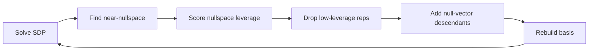

$$
\gdef\trace{\operatorname{Tr}}
\gdef\ket#1{\vert#1\rangle}
\gdef\bra#1{\langle#1\vert}
\gdef\innerprod#1#2{\langle #1 \vert #2 \rangle}
\gdef\ksymm{\mathcal{K}}
$$

### *1. Quantum many-body bootstrap (QMBB) basic*
Solving the groundstate of a general Hamiltonian,
$$
    \min_\rho \trace\left[\rho H\right] \quad \text{s.t.}\quad \rho^\dag=\rho,\ \trace\rho = 1,\ \rho\succcurlyeq 0.
$$
The density matrix $\rho$ is a positive semi-definite (PSD), normalized hermitian matrix. PSD means that for any state $\vert\phi\rangle$,
$$
    \langle\phi\vert\rho\vert\phi\rangle = \sum_i p_i \vert \innerprod{\phi}{\psi_i} \vert^2 \geqslant 0.
$$
Variational methods parameterize $\rho$ with controlled number of parameters, usually scaling with system size in a power law, by adopting wisely a variational ansatz $\rho_\theta$. The original problem is transformed into solving $\rho_\theta$, which yields strictly an upper bound of groundstate energy.

Instead, bootstrap methods enlarge the target space of $\rho$ by relaxing the semi-definite constraints. Rewrite the PSD condition as
$$
    \rho\succcurlyeq 0 \ \iff\ \rho = O^\dag O \ \iff\ \forall S\succcurlyeq 0,\ \trace\left[\rho S\right] \geqslant 0.
$$
One relaxes $S$ to a set of chosen PSD matrix $S_i$ such that the original problem is reduced to an easier one,
$$
    \min_\rho \trace\left[\rho H\right] \quad \text{s.t.}\quad \rho^\dag=\rho;\ \trace\rho = 1;\ \forall\ S_i\succcurlyeq 0,\ \trace\left[\rho S_i\right] \geqslant 0.
$$
This gives strictly a lower bound of groundstate energy. The effectiveness of the method therefore relies on the wise choice of $S_i$ set.

Consider an operator basis $\{O_i\}$, where the Hamiltonian can be represented as a linear combination of $O_i^\dag O_j$. For any operator $O=w_i O_i$, $O^\dag O$ is a PSD operator and we require
$$
    w_i^\ast w_j \trace \left[\rho O_i^\dag O_j\right] \geqslant 0.
$$
If we define $M_{ij}\overset{!}{=}\trace\left[\rho O_i^\dag O_j\right]=\langle O_i^\dag O_j\rangle$, the above positivity constraints state that $M$ is a PSD matrix. Obviously, not all entries of $M$ are independent; symmetries impose powerful constraints that either force elements to vanish or introduce linear dependencies among them. Other basic constraints include:
* $\trace\rho=1$ requires $M_{11} = 1$;

* $\rho^\dag = \rho$ yields $\langle O_i^\dag O_j\rangle^\ast = \langle O_j^\dag O_i\rangle$ such that $M$ is a hermitian.

In practice, one reduces the number of independent moment expectations in $M_{ij}$ using *symmetries* and other physics-insighted constraints. This generates a set of feasible regions for the moment vector, including the energy expectation whenever $H$ is represented in the chosen operator algebra. The relaxed feasible region is usually larger than the true physical set. Therefore minimizing the linear energy functional over this region gives a certified lower bound,
$$
    E_\mathrm{boot} = \min_{\substack{M\succeq 0,\\[1pt] \mathrm{other\ constraints}}} \langle H\rangle \leq E_0.
$$
By considering increasingly large operator bases $\{O_i\}$, one imposes more positivity constraints and shrinks the feasible region. The resulting lower bounds form a hierarchy that improves toward the exact value in the complete-basis limit. Moreover, symmetries, e.g. translational invariance, further help reduce the moment matrix into symmetry blocks, which dramatically saves computational time.

#### *1.0. Complexity*
After choosing an operator basis, the bootstrap problem becomes a semidefinite program of the form
$$
    \min_{\mathbf{x}}\left(\mathbf{c}^T\mathbf{x}\right)
    \quad \text{s.t.}\quad
    A\mathbf{x}=\mathbf{b}, \quad
    M_\ell(\mathbf{x})\succeq 0,\quad \ell=1,\dots,B,
$$
where $\mathbf{x}$ is the vector of independent moment variables and $M_\ell$ are PSD blocks of sizes $d_\ell$. Thus the numerical cost is controlled by the number of variables, the number of affine constraints, the PSD block sizes $\{d_\ell\}$, and the sparsity of the affine maps, rather than directly by the many-body Hilbert-space dimension.

For first-order conic solvers (e.g. SCS), a typical per-iteration bottleneck is the projection onto PSD cones, which requires diagonalizing the PSD blocks and scales roughly as
$$
    \sum_{\ell=1}^B O(d_\ell^3),
$$
together with sparse matrix-vector operations for the affine constraints. Interior-point solvers (e.g. MOSEK) have stronger polynomial scaling because each iteration forms and solves a Schur-complement/KKT system.

This is why symmetry blocking is crucial. A single PSD matrix of size $D$ has projection cost $O(D^3)$ and dense storage $O(D^2)$. If symmetry decomposes it into blocks of sizes $d_\ell$ with $\sum_\ell d_\ell=D$, the cost becomes controlled by $\sum_\ell d_\ell^3$, which can be much smaller than $D^3$. For example, translation symmetry turns one $LN\times LN$ translated moment matrix into $L$ momentum blocks of size $N$, reducing the PSD projection cost from $O(L^3N^3)$ to $O(LN^3)$. Additional parity or internal-symmetry blocks further reduce the block sizes.

#### *1.1. Symmetry constraints*
In finite-size systems, the ground state of a symmetric Hamiltonian is often itself a symmetric state, especially when the ground state is unique. Even for phases that spontaneously break a symmetry in the thermodynamic limit, choosing a symmetric density matrix does not change the ground-state energy: if $H$ is invariant under a symmetry group $G$, one can average any ground-state density matrix over the group,
$$
    \rho_\mathrm{sym} = \int_G dg\, g^{-1}\rho g,
$$
and obtain $\rho_\mathrm{sym}$ with the same energy. Therefore, for energy bootstrap purposes, it is natural to work with a $G$-symmetric $\rho$, while remembering that symmetry-breaking order parameters must then be detected through symmetry-invariant observables such as two-point correlations.

For a symmetric density matrix, the expectation value of an operator $O$ only depends on the component of $O$ projected to the $G$-invariant operator subspace,
$$
    \langle O\rangle
    = \trace\left[\rho_\mathrm{sym} O\right]
    = \trace\left[\rho O_G\right],
    \quad
    O_G = \int_G dg\, g^{-1} O g.
$$
Equivalently, if $O$ is completely orthogonal to the trivial representation of $G$, then $O_G=0$ and $\langle O\rangle=0$. A concrete example is fermion parity $P_f = (-1)^N$. An operator with fermion parity $q=0,1$ satisfies
$$
    P_f^{-1} O_q P_f = (-1)^q O_q.
$$
The group average over $\{1,P_f\}$ gives
$$
    (O_q)_G = \frac12\left(O_q + P_f^{-1}O_qP_f\right)
    = \frac12\left[1+(-1)^q\right]O_q.
$$
Thus only fermion-parity-even operators survive the projection, while parity-odd operators, such as a single fermion operator, have zero one-point expectation value in a parity-symmetric density matrix. At the moment-matrix level, $\langle O_i^\dag O_j\rangle$ vanishes when $O_i$ and $O_j$ are fermion-parity eigenoperators and carry different fermion parity, which is why the PSD matrix can be block diagonalized by parity sectors. In bootstrap language, discrete symmetry operations therefore give a set of equivalent expectation values and zero constraints,
$$
    \left\langle O\right\rangle = \trace\left[\rho_\mathrm{sym} O\right] = \trace\left[g^{-1}\rho_\mathrm{sym} g O\right] = \left\langle g O g^{-1}\right\rangle.
$$
for arbitrary operator $O$.

For continuous symmetries, the same equivalence relations can be written infinitesimally as Ward identities. If $g(\theta)=e^{i\theta Q}$ and $Q$ is Lie generator (symmetry charge), the symmetry condition on the density matrix is equivalently formulated as $\left[\rho, Q\right] = 0$. Then symmetry implies
$$
    \left\langle O\right\rangle = \left\langle e^{i\theta Q} O e^{-i\theta Q}\right\rangle \overset{\theta\ll 1}{\implies} \left\langle \left[Q,O\right]\right\rangle=0,
$$
which are known as Ward-identity constraints associated with the continuous symmetry. These relations are used to reduce the number of moment variables and to impose linear consistency constraints in the SDP. Specifically, time translation is a continuous unitary transformation generated by the Hamiltonian $U=e^{-iHt}$ such that
$$
    \left\langle \left[H,O\right]\right\rangle = 0,
$$
given stationary states $[\rho,H]=0$. These constraints are often known as stationarity constraints.

In summary, the bootstrap uses (discrete) symmetries in three closely related ways:
* *Selection rules for symmetry eigenoperators:* if an operator is already a symmetry eigenoperator with nontrivial charge, its expectation value vanishes in a symmetric state and can be removed directly (implemented as `sym_allowed`).
* *Canonicalization and identification of equivalent moments:* operators related by symmetry transformations represent the same expectation value (implemented as `sym_canon`).
* *Block decomposition of PSD matrices into independent charge or momentum sectors:* in practice this is simplest for discrete Abelian symmetries, where the operator basis can be chosen to carry definite symmetry charges (as discussed below).

For continuous symmetries, one may either use a convenient discrete subgroup as above, or impose the infinitesimal form of the symmetry as Ward identities.

#### *1.2. Symmetry blocks*

The PSD moment matrix has a special structure because its entries are expectations of operator products,
$$
    M_{ij}=\langle O_i^\dag O_j\rangle.
$$
If the density matrix is $G$-symmetric, then only the trivial-representation component of $O_i^\dag O_j$ can contribute. Equivalently, after choosing a symmetry-adapted operator basis, the moment matrix can be organized by irreducible representations of $G$.

Let the operator space decompose as
$$
    \mathcal{V}=\bigoplus_\lambda \left(\mathbb{C}^{m_\lambda}\otimes V_\lambda\right),
$$
where $V_\lambda$ is an irreducible representation and $m_\lambda$ is its multiplicity. Choosing operators $O_{\lambda,a,\alpha}$ with copy index $a$ and irrep index $\alpha$, the symmetry action is
$$
    g^{-1}O_{\lambda,a,\alpha}g
    = \sum_\beta D^{(\lambda)}_{\beta\alpha}(g) O_{\lambda,a,\beta}.
$$
The invariant moment form satisfies
$$
    M = D(g)^\dag M D(g), \quad \forall g\in G.
$$
By Schur's lemma, matrix elements between inequivalent irreducible representations vanish, while equivalent copies may still mix, i.e.
$$
    M = \bigoplus_\lambda \left(A_\lambda\otimes I_{\dim V_\lambda}\right),
$$
where $A_\lambda$ acts on the multiplicity space. Thus the original PSD constraint is equivalent to independent PSD constraints on the smaller blocks $A_\lambda$. This irrep-level block diagonalization assumes that the operator space has already been rotated into a symmetry-adapted basis $\mathcal{V}$. For a generic Pauli-string or Majorana-monomial basis, such a unitary transformation can be dense and computationally unfavorable since it destroys the sparse product structure of local operator strings. (Moment entries that were compiled from products $O_i^\dag O_j$ may become dense sums of many operator products, increasing time cost and memory use during both compilation and SDP solving.)

For Abelian symmetries this structure is especially simple because every irreducible representation is one-dimensional and labeled by a character, or charge. If
$$
    g^{-1}O_a g = \chi_a(g) O_a,
$$
then
$$
    g^{-1}(O_a^\dag O_b)g = \chi_a(g)^\ast\chi_b(g) O_a^\dag O_b.
$$
Equivalently, the group-averaged projection of this moment operator is
$$
    \left(O_a^\dag O_b\right)_G
    = \int_G dg\, g^{-1}\left(O_a^\dag O_b\right)g
    = \left[\int_G dg\, \chi_a(g)^\ast\chi_b(g)\right] O_a^\dag O_b.
$$
Character orthogonality gives
$$
    \int_G dg\, \chi_a(g)^\ast\chi_b(g) = \delta_{\chi_a,\chi_b},
$$
with the normalized Haar measure, or the normalized finite-group sum. Hence $O_a^\dag O_b$ has a nonzero invariant projection only when $\chi_a=\chi_b$. Since a symmetric density matrix only sees the invariant component, the moment entry $\langle O_a^\dag O_b\rangle$ vanishes between different Abelian charge sectors. Therefore the PSD matrix becomes block diagonal by Abelian charges. This is the logic behind constructing parity and momentum blocks.

> Pauli strings and Majorana monomials are already parity eigenoperators, so parity blocking mostly amounts to sorting by charge. Momentum blocks require a Fourier transform, but each $O_a(k)$ only mixes the $L$ translations of a single representative $O_a$, rather than all $L\times N$ translated basis elements.

In practice, even when the full symmetry is larger or non-Abelian, it is often convenient to use discrete Abelian subgroups or commuting Abelian charges to obtain block decompositions with minimal implementation overhead.

#### *1.3. Translation*
Translation is a finite Abelian symmetry. For a periodic chain of length $L$,
$$
    G=\{T(s),\ s=0,\dots,L-1\},
$$
with one-dimensional characters $\chi_k(s)=e^{iks}$ and $k=2\pi n/L$. Starting from a translation representative $O_a(0)$, define
$$
    O_a(r)=T^\dag(r)O_a(0)T(r), \quad
    O_a(k)=\frac{1}{\sqrt L}\sum_{r=0}^{L-1} e^{-ikr}O_a(r).
$$
Then $T^\dag(s)O_a(k)T(s)=e^{iks}O_a(k)$, so $O_a(k)$ carries Abelian charge $k$. Character orthogonality gives
$$
    \left\langle O_a^\dag(k)O_b(k')\right\rangle=0,\quad k\ne k',
$$
and the translated moment matrix decomposes as
$$
    F^\dag M F=\bigoplus_k M(k).
$$
Equivalently, the large PSD constraint $M\succcurlyeq 0$ is replaced by independent constraints $M(k)\succcurlyeq0$ for all $k$ since Fourier transformation $F$ is unitary. The block entries are
$$
    M_{ab}(k)=\sum_{r=0}^{L-1}e^{ikr}\left\langle O_a^\dag(r)O_b(0)\right\rangle.
$$
This Fourier transform only mixes the $L$ translated copies of each representative, not all $L\times N$ translated basis elements. In practice, solving SDP with $L$ number of small $M(k)$ is much more efficient than that with a large $M$; and one may involve more other symmetries to further simplify $M(k)$. We note that larger system size $L$ only provides linearly more PSD blocks, whose size is determined by the dimension of chosen basis but not $L$.

> To get our hands dirty, let us rederive the momentum block structure from scratch. Choose a set of translation representatives $\{O_a\}$ and build the full basis through translation,
> $$
>     \left\{O_a(r): T^\dag(r)O_a(0) T(r)\right\}.
> $$
> The moment matrix is constructed as
> $$
> \begin{aligned}
>     M_{ar,br'}
>     & \overset{!}{=} \left\langle O_a^\dag(r) O_b(r')\right\rangle
>     = \left\langle T^\dag(r) O^\dag_a(0) T(r-r') O_b(0) T(r')\right\rangle\\[10pt]
>     & = \trace\left[\underbrace{T(r') \rho T^\dag(r')}_{\rho} \underbrace{T^\dag(r-r') O^\dag_a(0) T(r-r')}_{O_a^\dag(r-r')} O_b(0)\right]\\[10pt]
>     & = \left\langle O_a^\dag(r-r') O_b(0)\right\rangle \overset{!}{=} M_{ab}(r-r').
> \end{aligned}
> $$
> Therefore $M$ is intrinsically a $L\times L$ block matrix with each block a $N\times N$ matrix where $N=\text{dim}(\{O_a\})$. To be more specific,
> $$
>     M = \begin{pmatrix}
>         M_0     & M^\dag_1 & M^\dag_2 & \cdots & M^\dag_{L-1}\\[5pt]
>         M_1     & M_0      & M^\dag_1 & \ddots & \vdots      \\[5pt]
>         M_2     & M_1      & M_0      & \ddots & \vdots      \\[5pt]
>         \vdots  & \ddots   & \ddots   & \ddots & \vdots      \\[5pt]
>         M_{L-1} & \cdots   & \cdots   & \cdots & M_0
>     \end{pmatrix}.
> $$
> $M_0$ is a $N\times N$ hermitian while $M_1,\dots,M_{L-1}$ are not necessarily hermitians. $M$ is ready to be block diagonalized by switching to the momentum space through discrete Fourier transformation $O_a(k)=\frac{1}{\sqrt{L}}\sum_r O_a(r) e^{-ikr}$ and $k\in\{k_n=\frac{2\pi n}{L}, 0\leqslant n<L\}$. We obtain
> $$
>     \left\langle O^\dag_a(k) O_b(k')\right\rangle
>     = \delta_{kk'} \sum_r e^{ikr} \left\langle O^\dag_a(r) O_b(0)\right\rangle.
> $$

Refer to:
* https://arxiv.org/pdf/2406.17844 : extensive benchmark on TFIM

* https://arxiv.org/pdf/2111.13007

* https://github.com/EverettYou/QuantumBootstrap : bootstrap in the krylov space [?]

* https://arxiv.org/pdf/2006.06002, https://arxiv.org/pdf/2410.00810 : Hubbard model

### *2. Primal and dual SDPs*
The standard primal semidefinite program is
$$
    \min_X\ \trace(CX)
    \quad \text{subject to}\quad X\succeq 0;\quad \trace(A_i X)=b_i,\ i=1,\dots,m.
$$
Note that
* $X$ is the positive semidefinite matrix variable.
* $C$ defines the linear objective.
* $A_i$ define affine equality constraints.
* $b_i$ are known constants.

Geometrically, the feasible set is the intersection of the PSD cone with affine hyperplanes. The primal problem minimizes a linear functional over this convex set.

Introduce one dual variable $y_i$ for each affine equality constraint. The dual problem is
$$
    \max_y\ \sum_{i=1}^m b_i y_i
    \quad\text{subject to}\quad S = C - \sum_{i=1}^m y_i A_i \succeq 0.
$$
The matrix $S$ is the dual slack matrix. *Weak duality* states that for any primal-feasible $X$ and dual-feasible $y$, the feasible dual value is a rigorous lower bound on feasible primal energy. Consider
$$
\begin{aligned}
    \trace(CX)
    &= \trace\left[\left(S+\sum_i y_i A_i\right)X\right] \\[5pt]
    &= \trace(SX)+\sum_i y_i\trace(A_iX) \\[5pt]
    &= \trace(SX)+\sum_i b_i y_i.
\end{aligned}
$$
Since $S\succeq 0$ and $X\succeq 0$,
$$
    \trace(SX)\ge 0.
$$
Therefore it is proved that
$$
    \trace(CX)\ge \sum_i b_i y_i.
$$

Under regularity assumptions such as Slater-type interior feasibility, the primal and dual optimal values coincide (*strong duality*),
$$
    \trace(CX^*) = \sum_i b_i y_i^*.
$$
Combining this with the weak-duality identity gives
$$
    \trace(S^*X^*)=0.
$$
This is *complementary slackness*. Since both $S^*$ and $X^*$ are positive semidefinite, their supports are orthogonal. Directions where the dual slack matrix has positive eigenvalue must be null directions of the primal moment matrix.

In bootstrap language:
* $X^*$ is the optimal moment matrix.
* $S^*$ is the optimal dual certificate or sum-of-squares matrix.
* Null vectors of $X^*$ correspond to null operators on the putative ground state.
* Positive directions of $S^*$ identify algebraic directions excluded by the dual certificate.

This is the formal reason dual certificates and primal null spaces are useful for active-set style pruning and growth.

Refs:
* https://people.eecs.berkeley.edu/~elghaoui/Teaching/EE227A/lecture11.pdf
* https://www.cs.cmu.edu/afs/cs.cmu.edu/academic/class/15859-f11/www/notes/lecture12.pdf

### *3. Nullspace-Guided Adaptive (NGA) algorithm for many-body bootstrap problem*
We formulate the many-body bootstrap problem first in terms of primal SDP:
$$
\begin{aligned}
    &\min_\mathbf{x}\ \langle \mathcal{H}\rangle = \mathbf{c}^T \mathbf{x}\\[5pt]
    &\text{subject to}\quad M(\mathbf{x})\succeq 0;\quad A\mathbf{x}=\mathbf{b}.
\end{aligned}
$$
Let $\mathbf{x}$ be the vector of independent expectation values of the operator algebra. The elements $M_{ij}$ are linear combinations of these expectation values: $M(\mathbf{x})=\sum_k x_k M^{(k)}$, where $M^{(k)}$ are constant symmetric (or more generally hermitian) matrices defining the algebraic structure.

#### *3.1. Lagrangian dual problem*
The clues of constructing the dual problem come from the Lagrangian. Introduce multipliers:
* A vector $\boldsymbol{\lambda}$ for the affine constraints $A\mathbf{x}=\mathbf{b}$.
* A PSD matrix $Y\succeq 0$ for the moment-matrix constraint $M(\mathbf{x})\succeq 0$.

Use the Lagrangian
$$
    L(\mathbf{x},\boldsymbol{\lambda},Y)
    = \mathbf{c}^T\mathbf{x}
    - \boldsymbol{\lambda}^T(A\mathbf{x}-\mathbf{b})
    - \trace\left[Y M(\mathbf{x})\right].
$$
For any primal-feasible $\mathbf{x}$, $A\mathbf{x}=\mathbf{b}$ and $M(\mathbf{x})\succeq 0$. Therefore
$$
    L(\mathbf{x},\boldsymbol{\lambda},Y) \le \mathbf{c}^T\mathbf{x}.
$$
So for fixed $(\boldsymbol{\lambda},Y)$, define the dual function
$$
    g(\boldsymbol{\lambda},Y)
    = \inf_\mathbf{x} L(\mathbf{x},\boldsymbol{\lambda},Y).
$$
Here the infimum is taken over all moment vectors $\mathbf{x}$, not only over primal-feasible ones. Hence for any feasible $\mathbf{x}_{\mathrm{feas}}$,
$$
    g(\boldsymbol{\lambda},Y)
    \le L(\mathbf{x}_{\mathrm{feas}},\boldsymbol{\lambda},Y)
    \le \mathbf{c}^T\mathbf{x}_{\mathrm{feas}}.
$$
Since this holds for every feasible $\mathbf{x}_{\mathrm{feas}}$, it also holds after minimizing over all feasible points:
$$
    g(\boldsymbol{\lambda},Y)
    \le
    \min_{\mathbf{x}:\ A\mathbf{x}=\mathbf{b},\ M(\mathbf{x})\succeq 0}
    \mathbf{c}^T\mathbf{x}.
$$
Thus each fixed pair $(\boldsymbol{\lambda},Y)$ gives one certified lower bound on the primal optimum. The dual problem is to choose $(\boldsymbol{\lambda},Y)$ so that this lower bound is as large as possible.

Now minimize the Lagrangian over the unconstrained moment vector $\mathbf{x}$. Since $M(\mathbf{x})$ is linear in $\mathbf{x}$, the Lagrangian is also linear in $\mathbf{x}$. Its infimum is finite only if all $\mathbf{x}$-dependent terms cancel. At the $M(\mathbf{x})$ level, this cancellation condition is the identity
$$
    \forall\ \mathbf{x}, \quad
    \mathbf{c}^T\mathbf{x}
    = \boldsymbol{\lambda}^T A\mathbf{x}
    + \trace\left[Y M(\mathbf{x})\right].
$$
This is equivalent to
$$
    c_k = \left(A^T\boldsymbol{\lambda}\right)_k + \trace\left[Y M^{(k)}\right], \quad k=1,\dots,n.
$$
When this identity holds, the Lagrangian reduces to the constant $L(\mathbf{x},\boldsymbol{\lambda},Y) = \boldsymbol{\lambda}^T\mathbf{b}$,
so
$$
    g(\boldsymbol{\lambda},Y)=\boldsymbol{\lambda}^T\mathbf{b}.
$$
Thus the dual bootstrap problem is
$$
\begin{aligned}
    &\max_{\boldsymbol{\lambda},Y}\quad
    \boldsymbol{\lambda}^T\mathbf{b}\\[5pt]
    &\text{subject to}\quad
    Y\succeq 0;
    \quad c_k = \left(A^T\boldsymbol{\lambda}\right)_k + \trace\left[Y M^{(k)}\right].
\end{aligned}
$$
For any feasible bootstrap moment vector $\mathbf{x}$, the same identity gives
$$
\begin{aligned}
    \mathbf{c}^T\mathbf{x}
    &= \boldsymbol{\lambda}^T A\mathbf{x}
    + \trace\left[Y M(\mathbf{x})\right] \\[5pt]
    &= \boldsymbol{\lambda}^T\mathbf{b}
    + \trace\left[Y M(\mathbf{x})\right] \\[5pt]
    &\ge \boldsymbol{\lambda}^T\mathbf{b}.
\end{aligned}
$$
Therefore $\boldsymbol{\lambda}^T\mathbf{b}$ is the certified energy lower bound.

> Primal world and dual certificate:
>
> The primal solution gives a candidate moment assignment $\mathbf{x}^*$, i.e. possible expectation values of operators in the truncated bootstrap algebra. From it one can reconstruct the optimal moment matrix $M(\mathbf{x}^*)$. This object behaves like a relaxed density matrix: it need not come from an exact physical wavefunction, but it must satisfy all imposed positivity, symmetry, normalization, filling, and Ward constraints.
>
> The dual solution gives a certificate of the lower bound. It consists of affine multipliers $\boldsymbol{\lambda}^*$ and a PSD matrix $Y^*\succeq 0$ such that the Hamiltonian objective is decomposed into exact constraints plus a positive semidefinite (SOS) term. Therefore it proves that every feasible moment assignment has energy at least $\boldsymbol{\lambda}^{*T}\mathbf{b}$.
>
> Thus the primal solution is a possible optimal world of moments, while the dual solution is a proof that no feasible world can have lower energy. When strong duality holds, these two descriptions meet at the same optimal value.
>
> In numerical SDP solvers, the primal and dual solutions are usually computed together. For example, an interior-point solver evolves primal variables, dual variables, and slack variables simultaneously; first-order conic solvers such as SCS also report approximate primal and dual certificates. The solver does not only check the primal objective value. It typically monitors primal residuals, dual residuals, and the duality gap
> $$
>     \mathbf{c}^T\mathbf{x} - \boldsymbol{\lambda}^T\mathbf{b}.
> $$
> Small primal residual means the moment assignment nearly satisfies $A\mathbf{x}=\mathbf{b}$ and $M(\mathbf{x})\succeq 0$. Small dual residual means the certificate nearly satisfies $Y\succeq 0$ and $c_k=(A^T\boldsymbol{\lambda})_k+\trace[YM^{(k)}]$. Small duality gap means the candidate moment world and the certificate prove essentially the same energy.
>
> The primal and dual optimal values converge to the same value when strong duality holds and the solver reaches sufficient numerical accuracy. A standard sufficient condition is a Slater-type interior point: roughly, there is a strictly feasible primal point with $M(\mathbf{x})\succ 0$ satisfying the affine constraints, and a strictly feasible dual certificate with $Y\succ 0$ satisfying the dual stationarity equations. In bootstrap problems this condition can be weakened or fail because symmetries and Ward identities often force exact null directions, but strong duality can still hold after restricting to the correct support. Numerically, one should therefore expect equality only up to solver tolerance.

#### *3.2. Dual operator identity*
Start from the dual identity obtained above:
$$
    \forall\ \mathbf{x}, \quad
    \mathbf{c}^T\mathbf{x}
    = \boldsymbol{\lambda}^T A\mathbf{x}
    + \trace\left[Y M(\mathbf{x})\right].
$$
This identity is first a statement about linear functionals of the moment vector $\mathbf{x}$. To read it as an operator identity, identify the three pieces one by one.

* 
    First, the objective coefficients $\mathbf{c}$ encode the Hamiltonian in the chosen moment coordinates, and we have
    $$
        \mathbf{c}^T\mathbf{x}=\langle \mathcal{H}\rangle.
    $$

* 
    Second, the affine term is a linear combination of imposed exact constraints. It is often clearest to separate constraints into two classes:

    * the nonzero-RHS normalization constraint $\langle \mathcal{I}\rangle=1$;
    * zero-RHS constraints $\langle \mathcal{G}_\alpha\rangle=0$.

    Any known expectation-value constraint can be moved into the second class by subtracting its identity component. For example, fixed filling $\langle \mathcal{N}\rangle=n$ is equivalently written as $\langle \mathcal{N}-n\mathcal{I}\rangle=0$. Ward constraints are already zero-RHS constraints $\langle[\mathcal{C},\mathcal{O}_m]\rangle=0$. Thus the affine part can be written schematically as
    $$
        \boldsymbol{\lambda}^T A\mathbf{x}
        = \lambda_I\langle \mathcal{I}\rangle
        + \lambda_N\langle \mathcal{N}-n\mathcal{I}\rangle
        + \sum_m \lambda_m\langle[\mathcal{C},\mathcal{O}_m]\rangle.
    $$
    Here $\mathcal{C}$ can be the Hamiltonian for stationarity constraints, or a symmetry charge for Ward identities.

* 
    Third, the PSD term is the sum-of-squares (SOS) part. Let the bootstrap operator basis for the moment matrix be $\mathcal{S}=\{\mathcal{O}_1,\cdots,\mathcal{O}_N\}$, so that
    $$
        M_{ij}(\mathbf{x})=\langle \mathcal{O}_i^\dag \mathcal{O}_j\rangle.
    $$
    Since $Y\succeq 0$, write its spectral decomposition as
    $$
        Y=\sum_a y_a |v_a\rangle\langle v_a|, \quad y_a>0.
    $$
    Define
    $$
        \mathcal{P}_a=\sqrt{y_a}\sum_i (v_a)_i \mathcal{O}_i.
    $$
    Then
    $$
        \trace\left[Y M(\mathbf{x})\right]
        = \sum_a \langle \mathcal{P}_a^\dag \mathcal{P}_a\rangle.
    $$
    $Y$ denotes the coefficients of SOS operators.

Note we use the convention where normalization is the only nonzero-RHS constraint, while fixed filling is written as the zero-RHS constraint $\langle\mathcal{N}-n\mathcal{I}\rangle=0$. Therefore the dual objective
$$
    E_{\mathrm{bound}}\overset{!}{=}\boldsymbol{\lambda}^T\mathbf{b}=\lambda_I.
$$
Thus the dual SDP can be read as maximizing the identity multiplier $\lambda_I$, while the other multipliers and the SOS matrix $Y$ determine whether that value is certifiable. As a result, in the zero-RHS convention, the dual identity can be read as the expectation-value identity
$$
    \langle \mathcal{H}\rangle
    = E_{\mathrm{bound}}\langle \mathcal{I}\rangle
    + \lambda_N\langle \mathcal{N}-n\mathcal{I}\rangle
    + \sum_m \lambda_m\langle[\mathcal{C},\mathcal{O}_m]\rangle
    + \sum_a \langle\mathcal{P}_a^\dag\mathcal{P}_a\rangle,
$$
where all terms after $E_{\mathrm{bound}}\langle \mathcal{I}\rangle$ are zero-expectation constraints or nonnegative SOS terms. Equivalently,
$$
    \mathcal{H} - E_{\mathrm{bound}}\mathcal{I}
    = \lambda_N(\mathcal{N}-n\mathcal{I})
    + \sum_m \lambda_m \left[\mathcal{C},\mathcal{O}_m\right]
    + \sum_a \mathcal{P}_a^\dag \mathcal{P}_a.
$$
This is an *operator identity* at the level of the truncated operator algebra. Variational dual variables include multipliers $\boldsymbol{\lambda}$ (such as $E_{\mathrm{bound}}=\lambda_I$, $\lambda_N$ and $\lambda_m$) and SOS operators $\mathcal{P}_a$. The dual SDP is therefore the problem of finding the largest scalar $E_{\mathrm{bound}}$ for which $\mathcal{H}-E_{\mathrm{bound}}\mathcal{I}$ can be represented as a linear combination of exact zero-expectation constraints plus an SOS operator.

For any feasible bootstrap moment assignment, the filling and Ward terms have zero expectation and the SOS term is nonnegative. This proves $\langle \mathcal{H}\rangle\ge E_{\mathrm{bound}}$. Strictly speaking, this is a projected identity in the current truncated bootstrap algebra, not necessarily an exact identity in the full operator algebra unless the chosen basis is closed under all generated terms.

#### *3.3. Complementary slackness*
For a certified optimal solution, we often expect the primal and dual values to meet up to numerical tolerance,
$$
    \langle \mathcal{H}\rangle^* \simeq E_{\mathrm{bound}}^*.
$$
Using the dual operator identity at the optimal dual point gives
$$
    \langle \mathcal{H}\rangle^* - E_{\mathrm{bound}}^*
    = \sum_a \left\langle \mathcal{P}_a^{*\dag}\mathcal{P}_a^* \right\rangle_{\mathbf{x}^*},
$$
where the filling and Ward terms vanish on the feasible primal moment assignment $\mathbf{x}^*$. If the duality gap is zero, or numerically very small, then
$$
    \left\langle \mathcal{P}_a^{*\dag}\mathcal{P}_a^* \right\rangle_{\mathbf{x}^*} \simeq 0.
$$
This is the bootstrap version of *complementary slackness*. In matrix form it says $\trace\left[Y^*M(\mathbf{x}^*)\right]\simeq 0$. Since both $Y^*\succeq 0$ and $M(\mathbf{x}^*)\succeq 0$, this trace can vanish only when their positive supports are orthogonal. Equivalently, positive eigendirections of the dual SOS matrix $Y^*$ must lie in the nullspace of the primal moment matrix $M(\mathbf{x}^*)$,
$$
    \mathcal{P}_a^*\left|\psi^*_0\right\rangle \simeq 0.
$$
Thus each nonzero SOS operator $\mathcal{P}_a^*$ gives an approximate projected annihilator of the optimal bootstrap ground state. In the Gram matrix language, this means it contributes a zero direction of $M(\mathbf{x}^*)$. This is useful information because it identifies an algebraic relation saturated by the approximate ground state. (The ground state can be characterized by algebraic relations that annihilate it?)

A naive pruning step is to rotate the basis into null directions and remaining support directions,
$$
    \operatorname{span}\{\mathcal{O}_i\}
    = \operatorname{span}\{\mathcal{P}_a^*\}
    \oplus
    \operatorname{span}\{\mathcal{Q}_r\},
$$
and build the next SDP using the null directions $\mathcal{P}_a^*$, or equivalently restrict the moment matrix to the nullspace of $M(\mathbf{x}^*)$. This however makes the PSD constraints dense. In practice, we prune the representatitve basis based on its leverage in the nullspace.

#### *3.4. How to grow $\mathcal{S}$?*
Pruning alone does not usually improve the bootstrap bound. It removes representatives weakly involved in the current null relations, but the improvement comes from adding new operators to the PSD test space. A useful growth rule is to use the null operators discovered in the previous SDP. If
$$
    \mathcal{P}_a|\psi_0\rangle\simeq 0,
$$
then $\mathcal{P}_a$ can be viewed as an approximate projected ground-state equation. A true relation should not be isolated: it should generate further relations under Hamiltonian, symmetry, or local-operator actions. For example, if $\mathcal{H}|\psi_0\rangle=E_0|\psi_0\rangle$, then
$$
    [\mathcal{H},\mathcal{P}_a]|\psi_0\rangle \simeq 0.
$$
Similarly, for a simple local operator $\mathcal{A}$,
$$
    \mathcal{A}\mathcal{P}_a|\psi_0\rangle\simeq 0.
$$
Thus the descendants
$$
    [\mathcal{H},\mathcal{P}_a],\ 
    \mathcal{A}\mathcal{P}_a,\ 
    [\mathcal{C},\mathcal{P}_a]
$$
are natural objects to expand in the raw operator algebra. In practice one should not multiply by arbitrary operators. The local operator $\mathcal{A}$ should be chosen from simple terms near the support of $\mathcal{P}_a$, such as local Hamiltonian terms or symmetry generators. This keeps the growth near the algebraic boundary of the current null relation. The new low-complexity raw monomials appearing in these descendants, but missing from the current basis, are good candidates to add to the next SDP.

These expansions reveal which raw operator directions are needed for the next SDP to test whether the previous null relation is self-consistent in a larger algebra. If the relation is physical, the enlarged SDP should make it more stable and reveal more of its closure. If it was a truncation artifact, the new descendant operators allow the next SDP to correct it: the old null direction may acquire nonzero norm, or it may disappear from the active dual certificate.

The active-set picture is therefore an iterative process
$$
    \text{solve}
    \rightarrow
    \text{prune}
    \rightarrow
    \text{grow}
    \rightarrow
    \text{solve}.
$$
After each solve, the primal nullspace and the dual SOS certificate propose approximate annihilating operators of the bootstrap ground state. Repeating the loop is a way to continually refine the candidate ground-state annihilators, i.e. towards the physical nullspace of ground state.

From the dual viewpoint, the same loop is also an iterative search for a better SOS certificate. When the basis is sufficiently strong, one hopes that the surviving stable $\mathcal{P}_a$ yield the true physical annihilators of the ground state. However, $\mathcal{P}_a^\dag$ is not automatically a strict excitation creation operator as $\mathcal{P}_a^\dag|\psi_0\rangle$ may not be an energy eigenstate. Therefore $\mathcal{P}_a^\dag$ should be viewed as an excitation-channel candidate, not automatically as a strict quasiparticle operator. In other words, the SOS certificate supplies candidate null relations, while the excitation problem lives on the remaining support.

Refs:
* https://docs.mosek.com/modeling-cookbook/duality.html
* https://docs.mosek.com/modeling-cookbook/sdo.html

### *4. NGA implementation*
The raw basis is a list of translation representatives,
$$
    \mathcal{S}=\{\mathcal{O}_\alpha\},
$$
and the PSD test space is built from their translation orbits. In momentum space, each momentum sector $k$ has its own PSD block
$$
    M_k(\mathbf{x})\succeq 0.
$$
In the NGA algorithm, $\mathcal{S}_t$ at step $t$ is dynamically pruned and grown based on the nullspace of current optimal $M_k(\mathbf{x}^\ast;t)$.

One iteration is:

1. **Solve the SDP given $\mathcal{S}_t$**.
   Obtain the optimal primal moment blocks $M_k(\mathbf{x}^\ast;t)$.

2. **Extract near-null directions.**
   Diagonalize each evaluated block,
   $$
       M_k(\mathbf{x}^*;t) v_{k,a}=\epsilon_{k,a} v_{k,a},
   $$
   and identify directions with $0\le \epsilon_{k,a}\lesssim \epsilon_{\mathrm{null}}$ as nullvectors. Each such vector defines an approximate annihilator to the approximate ground state with momentum $k$. In real space it is expanded as
   $$
       \mathcal{P}_{k,a}
       = \sum_\alpha (v_{k,a})_\alpha \frac{1}{L_\alpha} \sum_r e^{-ikr}\, \mathcal{T}_r\mathcal{O}_\alpha,
   $$
   where $L_\alpha$ is the translation orbit period.

3. **Score operators $\mathcal{O}_\alpha$ by nullspace leverage.**
   For each representative $\mathcal{O}_\alpha$, accumulate its weight in the retained null space across all momentum sectors. Schematically,
   $$
       \ell_\alpha
       = \frac{1}{L_\alpha}
       \sum_k \sum_a |(v_{k,a})_\alpha|^2.
   $$
   Low $\ell_\alpha$ means $\mathcal{O}_\alpha$ participates weakly in the currently binding null relations.

4. **Drop low-leverage representatives.**
   The identity and Hamiltonian terms are protected. Other representatives with $\ell_\alpha$ below a threshold are drop candidates. To avoid overly aggressive replacement, the number of dropped representatives per step is capped.

5. **Generate growth candidates from null-operator descendants.**
   For each null operator $\mathcal{P}_{k,a}$, compute
   $$
       [\mathcal{H},\mathcal{P}_{k,a}],
   $$
   expand it in the raw operator algebra, canonicalize by translation, and collect missing representatives. Descendant growth is capped by
   $$
       \#\mathrm{grow} - \#\mathrm{drop} \le \Delta_{\max}.
   $$
   If too few new descendants are found, undo the weakest tentative drops until
   $$
       \#\mathrm{grow} - \#\mathrm{drop} \ge \Delta_{\min}.
   $$
   Dropped representatives at the same step are not allowed to be re-added, but they may re-enter in later iterations.

6. **Update $\mathcal{S}_{t+1}$ and resolve.**

This yields an adaptive replacement rule:

Its physical interpretation is that the primal near-nullspace proposes approximate ground-state annihilators, while Hamiltonian descendants test whether those annihilators close under the dynamics (if so, they are more likely to be physical).

#### *4.1. Descendant commutator cache*
The naive growth procedure is expensive because each near-null PSD direction constructs a Fourier-expanded null operator and then calculates the commutator. For one momentum sector, write schematically
$$
    \mathcal{O}_a(k) = \frac{1}{\sqrt{L}} \sum_r e^{-ikr} \mathcal{O}_a(r).
$$
A near-null operator is
$$
    \mathcal{P}_\alpha(k) = \sum_a (v_{k\alpha})_a \mathcal{O}_a(k)
    = \frac{1}{\sqrt{L}} \sum_{a,r} (v_{k\alpha})_a e^{-ikr} \mathcal{O}_a(r).
$$
The Hubbard Hamiltonian is a sum of translated local terms,
$$
    H = \sum_{r'} h(r').
$$
The direct commutator is therefore
$$
    [H, \mathcal{P}_\alpha(k)]
    = \frac{1}{\sqrt{L}} \sum_{r,r',a} (v_{k\alpha})_a e^{-ikr} \left[h(r'), \mathcal{O}_a(r)\right].
$$
For a block with $B_k$ basis representatives, one null vector contains $O(B_k L)$ translated monomial terms, while $H$ contains $O(L)$ local terms. The current symbolic cost is roughly $O(B_k L^2)$ per $(k,\alpha)$, so if sector $k$ has $D_k$ null vectors, the cost of growth scales as
$$
    \sum_k O\left(D_k B_k L^2\right).
$$
For typical $D_k \sim D$, $B_k \sim B$, and $O(L)$ momentum sectors, this is $O\left(D B L^3\right)$.

To optimize the growth procedure, use translation invariance before applying null-vector coefficients.
$$
    \sum_{r'} \left[h(r'), \mathcal{O}_a(r)\right]
    = \sum_\delta \left[h(r+\delta), \mathcal{O}_a(r)\right]
    = \sum_\delta \mathcal{T}_r \left[h(\delta), \mathcal{O}_a(0)\right]
    \overset{!}{=} \mathcal{T}_r \mathcal{C}_a.
$$

Cache the relative local commutators
$$
    \mathcal{C}_a = \sum_\delta \left[h(\delta), \mathcal{O}_a(0)\right]
    = \left[H, \mathcal{O}_a(0)\right]
    = \sum_{s,b} C_{ab}(s) \mathcal{T}_s \mathcal{O}'_b.
$$
$\mathcal{O}'_b$ are translational representatives with $\{\mathcal{T}_s\mathcal{O}'_b\}$ spanning the new basis space including incoming descendants. $C_{ab}(s)$ is stored as a sparse map. This step takes naively $O(BL)$ number of monomial multiplications and $O(B)$ considering the locality of $H$ and $\mathcal{O}_a$.
$$
\begin{aligned}
    \mathcal{C}_\alpha(k) &\overset{!}{=} [H, \mathcal{P}_\alpha(k)]
    = \frac{1}{\sqrt{L}} \sum_{r,a} (v_{k\alpha})_a e^{-ikr} \mathcal{T}_r \mathcal{C}_a\\[5pt]
    &= \frac{1}{\sqrt{L}} \sum_{r,s,a,b} (v_{k\alpha})_a e^{-ikr} C_{ab}(s) \mathcal{T}_{r+s} \mathcal{O}'_b\\[5pt]
    &= \sum_b \underbrace{\left(\sum_{s,a} (v_{k\alpha})_a C_{ab}(s) e^{iks}\right)}_{[W_\alpha(k)]_b} \underbrace{\left(\frac{1}{\sqrt{L}} \sum_{r} e^{-ikr} \mathcal{T}_{r} \mathcal{O}'_b\right)}_{\mathcal{O}'_b(k)}.
\end{aligned}
$$
The score of certain descendant candidate $\mathcal{O}'_b$ is defined as
$$
    \sum_{k\alpha} \left\lvert[W_\alpha(k)]_b\right\rvert^2.
$$
For each momentum block $k$, $W(k)_{\alpha,b}$ are computed as a sparse-dense multiplication
$$
    W(k)_{\alpha,b} = \sum_{s,a} v_{\alpha,a}(k) C_{ab}(s) e^{iks}
$$
with cost $O[D_k\ \mathrm{nnz}(C)]$ per momentum block and $\mathrm{nnz}(C)=\left\lvert\{(a,b,s): C_{ab}(s)\neq 0\}\right\rvert$. In the ideal case, each commutator between hamiltonian and the local basis generates $O(1)$ local descendant terms, then $\mathrm{nnz}(C)\sim O(B)$ and hence evaluating $W(k)$ costs $O(D_k B)$ for each $k$ and roughly $O(DBL)$ for all $k$. Computing scores takes additional efforts proportional to $O(DBL)$. Therefore the total complexity is reduced from $O(D B L^3)$ to
$$
    O(DBL).
$$

### *5. Ising chain*
$$
    H = \sum_i -J Z_i Z_{i+1} - h X_i - h_z Z_i.
$$
The $2^N$-dim many-body basis are constructed via the tensor product $\ket{\sigma}=\bigotimes_{i=1}^{N}\vert\sigma_i\rangle$, where each local state $\vert\sigma_i\rangle$ is an eigenstate of $Z_i$ with eigenvalue $\sigma_i$. A general state $\ket{\psi}$ is a linear combination of $\ket{\sigma}$, $\ket{\psi}=\sum_\sigma a_\sigma\ket{\sigma}$, usually denoted as a $2^N$-dim column vector $(\dots, a_\sigma, \dots)^T$.

#### *5.1. Symmetry revisited*
General symmetries can be divided into basically two classes, unitary symmetries
$$
    \ket{\psi} \to U \ket{\psi},
$$
and anti-unitary symmetries
$$
    \ket{\psi} \to U \ksymm\ket{\psi} = U\ket{\psi}^\ast,
$$
where $\ksymm$ denotes the operation of complex conjugation and $\ksymm^2=1$. $\ksymm$ is anti-unitary because first it is anti-linear
$$
    \ksymm\ket{\psi} \overset{!}{=} \ket{\psi}^\ast = \sum_\sigma a_\sigma^\ast \ket{\sigma}.
$$
It satisfies
$$
    \langle\ksymm\phi\vert\ksymm\psi\rangle = \innerprod{\phi}{\psi}^\ast,
$$
which is consistent with *Wigner theorem* stating that two states transformed under the symmetry should have a preserved inner product amplitude. The Wigner theorem also forbids any mixed operation, $\ket{\psi} \to U_1 \ket{\psi} + U_2\ksymm \ket{\psi}$,to be a symmetry. Equivalently, in the Heisenberg picture, an operator $O$ transforms as $O \to U^\dag O U$ under unitary symmetries and as $O \to \ksymm U^\dag O U \ksymm$ under anti-unitary symmetries, with the operators applied sequentially from right to left. The anti-unitary operation $\ksymm O \ksymm$ is understood by acting it on an arbitrary state, which yields
$$
    \ket{\ksymm O \ksymm \psi}_{\sigma'}
    = \sum_\sigma \left(O_{\sigma'\sigma} a_\sigma^\ast \ket{\sigma}\right)^\ast
    = \sum_\sigma O^\ast_{\sigma'\sigma} a_\sigma \ket{\sigma}
    = \ket{O^\ast \psi}_{\sigma'},
$$
and $\ksymm O \ksymm = O^\ast$.

#### *5.2. $\ksymm$-symmetry*
For the transverse-field Ising (TFI) chain, we consider the simplest anti-unitary symmetry $\ksymm$. The Hamiltonian in our chosen basis $\{\ket{\sigma}\}$ is expressed as a purely real matrix $H^\ast=H$, and is hence invariant under complex conjugation $\ksymm$,
$$
    \ksymm H \ksymm = H.
$$
Assuming $\ket{\psi}$ is an eigenstate of $H$, we have
$$
    H \ket{\psi} = \ksymm H \ksymm \ket{\psi} = E \ket{\psi} \implies H \ket{\psi}^\ast = E \ket{\psi}^\ast.
$$
Therefore, $\ket{\psi}$ and $\ket{\psi}^\ast$ have the same energy. The logic is that if $\ket{\psi}$ and $\ket{\psi}^\ast$ are linearly independent, we can construct
$$
    \ket{\psi_+} \sim \ket{\psi} + \ket{\psi}^\ast, \quad
    \ket{\psi_-} \sim i \left(\ket{\psi} - \ket{\psi}^\ast\right),
$$
and both $\ket{\psi_\pm}$ are purely real-valued, $\ksymm$-even states. Otherwise, if $\ket{\psi}$ and $\ket{\psi}^\ast$ are the same state, then $\ket{\psi}$ itself is real-valued.  This guarantees that all energy eigenstates can be safely chosen as purely real-valued and $\ksymm$-even states without loss of generality. Note this is equivalent to stating that  the density matrix $\rho = \sum_n p_n \ket{\psi_n}\langle\psi_n\vert$ can be chosen as real-valued, symmetric and $\ksymm$-even matrices, where $\ket{\psi_n}$ can be any normalized $\ksymm$-even pure state. Below we will stick to the Heisenberg picture and assume a $\ksymm$-even density matrix $\rho_+$ throughout. This extends our discussions to mixed states such as thermal density matrix $\rho\sim e^{-\beta H}$ with very little effort.

To proceed, we categorize the operators based on their parity under $\ksymm$ into $\ksymm$-even and $\ksymm$-odd classes.
$$
    O = \underbrace{\frac{1}{2}\left(O + O^\ast\right)}_{O_+} + \underbrace{\frac{1}{2}\left(O - O^\ast\right)}_{O_-},
$$
and $\ksymm O_\pm\ksymm = O_\pm^\ast = \pm O_\pm$. The Hamiltonian $H$ is obviously $\ksymm$-even. Also, the $\ksymm$-parity is multiplicative, following a $\mathbb{Z}_2$ grading algebra: $O_\pm O_\pm=O_+$ and $O_\pm O_\mp=O_-$. For TFI chain, we consider a set of operators $\{O_i\}$ and each $O_i$ is a Pauli string $O=\bigotimes_{i=1}^N \sigma^\alpha_i$. $\ksymm$ symmetry applies on such a Pauli string as
$$
    \ksymm \left(\bigotimes_{i=1}^N \sigma^\alpha_i\right) \ksymm = \bigotimes_{i=1}^N \ksymm \sigma^\alpha_i \ksymm.
$$
Hence to determine whether a Pauli string is $K$-even or $K$-odd is simply to count the number of $Y$ operators it contains, $\ksymm O\ksymm = (-1)^{N_y} O$. Note that given a $\ksymm$-even $\rho_+$,
$$
    \langle O_\pm\rangle
    = \trace \left[\rho_+ O_\pm\right]
    = \pm \trace \left[\rho_+ \ksymm O_\pm \ksymm\right]
    = \pm \trace \left[\rho_+ O_\pm^\ast \right]
    = \pm \langle O_\pm\rangle^\ast.
$$
Therefore, $\langle O_+\rangle$ is real and $\langle O_-\rangle$ is purely imaginary with $O_\pm$ here not necessarily a hermitian.

We will show that the presence of $\ksymm$-symmetry facilitates the bootstrap calculation in the following aspects:

* It reveals the intrinsic structure of the moment matrix $M_{ij}=\langle O^\dag_i O_j\rangle$ such that we can transform it into a real-valued matrix. Assuming that we divide the Pauli string basis $\{O_i\}$ by class $\{O_+,O_-\}$, the moment matrix is expressed into a block form based on our discussion above
  $$
        M = \begin{pmatrix}M_1 & iM_3\\[5pt]-iM_3^T & M_2\\\end{pmatrix},
  $$
  where $M_1$ and $M_2$ are real symmetric matrices and $M_3$ a real matrix. This intrinsic structure of $M$ facilitates SDP calculations if we further consider a unitary transformation
  $$
        U = \begin{pmatrix}I & 0\\ 0 & iI\\\end{pmatrix}, \quad
        \tilde{M} = U^\dag M U = \begin{pmatrix}M_1 & -M_3\\[5pt]-M_3^T & M_2\\\end{pmatrix}.
  $$
  Now $\tilde{M}$ is a real symmetric matrix and by construction $M\succcurlyeq 0$ is equivalent to $\tilde{M}\succcurlyeq 0$. Since the backend SDP solvers are fundamentally designed to operate natively on real numbers, the bootstrap calculation shall benefit significantly from condensing $M$ from a hermitian to a symmetric matrix.
 
  > The above discussion applies in the real-space basis where $\{O_i\}$ involve all translation equivalents. In terms of moment PSD blocks as introduced in [Sec 1.2](#symmetry-blocks), $\ksymm$ symmetry imposes direct relation among $M(k)$. Because $\ksymm O_a(r)\ksymm = \eta_a O_a(r)$ with $\eta_a=\pm 1$ the $\ksymm$ parity of Pauli string $O_a$, we have
  > $$
  >     \ksymm O_a(k) \ksymm = \frac{1}{\sqrt{L}} \sum_r \ksymm \left[O_a(r) e^{-ikr}\right] \ksymm = \eta_a O_a(-k),
  > $$
  > and $\ksymm O^\dag_a(k) O_b(k) \ksymm = \eta_a\eta_b O^\dag_a(-k) O_b(-k)$. Assuming $\ksymm\rho\ksymm=\rho$, this leads to
  > $$
  >     \left\langle O^\dag_a(k) O_b(k) \right\rangle^\ast = \eta_a\eta_b \left\langle O^\dag_a(-k) O_b(-k) \right\rangle \iff M(k)^\ast = \text{diag}(\eta)\ M(-k)\ \text{diag}(\eta).
  > $$
  > Therefore, $\ksymm$ symmetry relates moment blocks with opposite momenta and yields
  > $$
  >     M(k)\succcurlyeq 0 \iff M^\ast(k)\succcurlyeq 0 \iff M(-k)\succcurlyeq 0.
  > $$
  > In the first step, $M(k)\succcurlyeq 0$ implies $M^\ast(k)\succcurlyeq 0$ since $M^\ast(k)=M^T(k)$ for hermitian $M(k)$. Then $M(k)\succcurlyeq 0$ and $M(-k)\succcurlyeq 0$ become equivalent because $\text{diag}(\eta)=\text{diag}(\dots,\eta_a,\dots)$ is unitary. This reduces the number of independent momentum PSD blocks by half with each $M(k)$ a hermitian.
  >

* It reduces the number of moment variables. In bootstrap, we identify the expectation values of Pauli strings $\mathcal{O}_{ij}$, associated to moment operators $O^\dag_i O_j$, as moment variables. A Pauli string is hermitian by nature, while it may differ from $O^\dag_i O_j$ by a pure real or imaginary factor and may have opposite parity. Consider a $\ksymm$-odd Pauli string, its expectation is purely complex given a symmetric $\rho_+$. And because Pauli string is a hermitian, its expectation must be real. This yields that the expectation of $K$-odd $\mathcal{O}_{ij}$ must vanish and we only need to consider $K$-even ones as moment variables.

* It implies that nontrivial stationarity constraints, $\langle[H,O]\rangle=0$ can only be generated from $K$-odd Pauli strings $\mathcal{O}_{ij}$. By definition, $[H, \mathcal{O}_{ij}]$ shares identical parity with $\mathcal{O}_{ij}$ and is anti-hermitian as long as $\mathcal{O}_{ij}$ is hermitian. Furthermore, if $\mathcal{O}_{ij}$ is $\ksymm$-even, we deduce $\langle[H, \mathcal{O}_{ij}]\rangle \in \mathbb{R}$ from the fact that $[H, \mathcal{O}_{ij}]$ is $\ksymm$-even. However, the anti-hermiticity of $[H, \mathcal{O}_{ij}]$ ensures its expectation value to be purely imaginary. And we conclude $\langle[H, \mathcal{O}_{ij}]\rangle \equiv 0$ from deduction. As a result, only $\ksymm$-odd $\mathcal{O}_{ij}$ generates valid stationarity constraints.

For TFI chain and general real-matrix Hamiltonians under certain basis, the assumption of real symmetric $\rho$ is physically natural. However, if the $\ksymm$-symmetry is spontaneously broken, e.g. by a non-trivial spin current, it can not see the symmetry-odd one-point order parameter, but the ordered phase may still be detected in symmetry-even two-point correlations. How to bootstrap dynamics? (find refs.)

### *6. $J_1$-$J_2$ Heisenberg chain*
Spin-$1/2$ $J_1$-$J_2$ Heisenberg chain
$$
\begin{aligned}
    H &= J_1 \sum_i \mathbf{S}_i \cdot \mathbf{S}_{i+1} + J_2 \sum_i \mathbf{S}_i \cdot \mathbf{S}_{i+2}\\[5pt]
    &= J_1/4 \sum_{i,a} \sigma^a_i \sigma^a_{i+1} + J_2/4 \sum_{i,a} \sigma^a_i \sigma^a_{i+2}.
\end{aligned}
$$
Let $\alpha=J_2/J_1$ in the antiferromagnetic frustrated regime $J_1>0$, $J_2\geq0$. The thermodynamic phase diagram is
* $0\leq\alpha<\alpha_c$: gapless Luttinger liquid connected to the nearest-neighbor Heisenberg chain at $\alpha=0$.
* $\alpha_c\simeq0.241167$: Berezinskii-Kosterlitz-Thouless transition.
* $\alpha>\alpha_c$: gapped dimerized phase with two symmetry-related dimer patterns.
* $\alpha=1/2$: Majumdar-Ghosh point, where the two nearest-neighbor singlet dimer coverings are exact ground states.
* At larger $\alpha$, the system remains dimerized but spin correlations become increasingly incommensurate.

Although the dimerized phase spontaneously breaks one-site translation in a pure thermodynamic ground state, the Hamiltonian remains one-site translation invariant. For energy-density bootstrap bounds, one can still restrict to a one-site translation-invariant density matrix: the symmetric mixture of the two dimerized ground states has the same energy. However, this forces the one-point dimer order parameter
$$
    \left\langle
    \mathbf{S}_i\cdot\mathbf{S}_{i+1}
    - \mathbf{S}_{i+1}\cdot\mathbf{S}_{i+2}
    \right\rangle
$$
to vanish. Dimerization should instead be diagnosed either with a two-site unit cell or with translation-invariant dimer-dimer correlations. Similar arguments apply for $SO(3)$ symmetry and many others.

#### *6.1. $SO(3)$ symmetry*
The isotropic Heisenberg chain has full spin-rotation symmetry. On states this is implemented by $SU(2)$, while on Pauli-vector operators it descends to $SO(3)$. We use the $SO(3)$ language below because the SDP moments are built from Pauli strings. In principle, one can use the full non-abelian $SO(3)$ symmetry to reduce PSD matrices. The operator basis at fixed momentum carries a representation of $SO(3)$,
$$
    \mathcal{U}(R)^\dag \mathcal{O}_a(k) \mathcal{U}(R)=\sum_b D_{ba}(R)\mathcal{O}_b(k).
$$
For an $SO(3)$-invariant density matrix, the moment matrix must commute with this representation. After rotating the Pauli-string basis into irreducible tensor sectors,
$$
    \mathcal{S}(k)\simeq\bigoplus_\ell\left(V_\ell\otimes\mathbb{C}^{m_\ell}\right),
$$
Schur's lemma gives
$$
    M(k)=\bigoplus_\ell\left(I_{2\ell+1}\otimes A_\ell(k)\right),\quad A_\ell(k)\succeq0.
$$
This would be the clean full-$SO(3)$ PSD block decomposition. We do not start with it because Pauli strings are not irreducible tensor operators; constructing this basis requires Clebsch-Gordan-like linear combinations and would complicate the prototype.

The practical plan is therefore twofold. First, use an abelian subgroup of the $SO(3)$ action to reduce PSD blocks. The convenient choice is the proper $\pi$-rotation subgroup
$$
    C_2\times C_2=\{1, R_{xy}, R_{yz}, R_{zx}\},
$$
where
$$
\begin{aligned}
    &R_{xy}: \mathcal{O}\mapsto (-1)^{N_X+N_Y}\mathcal{O},\\[5pt]
    &R_{yz}: \mathcal{O}\mapsto (-1)^{N_Y+N_Z}\mathcal{O},\\[5pt]
    &R_{zx}: \mathcal{O}\mapsto (-1)^{N_Z+N_X}\mathcal{O}.
\end{aligned}
$$
Here $N_X,N_Y,N_Z$ count the Pauli labels in the normal-form monomial $\mathcal{O}$. Since Pauli strings are eigenoperators of this abelian subgroup, if the density matrix is invariant under this subgroup, any monomial odd under one of these rotations has zero expectation value. Hence a necessary condition for a nonzero moment is
$$
    N_X = N_Y = N_Z \pmod 2.
$$

The same $C_2\times C_2$ charge can further block diagonalize each momentum PSD block. If $O_a(-k)$ and $O_b(k)$ carry different $\pi$-rotation charges, then $\langle O_a(k)^\dag O_b(k)\rangle=0$. Thus
$$
    M(k)=\bigoplus_q M_q(k),\quad q\in C_2\times C_2.
$$

Second, we impose the full continuous $SO(3)$ symmetry as affine Ward identities,
$$
    \left\langle [S^a_{\mathrm{tot}},\mathcal{O}]\right\rangle=0,\quad a=x,y,z.
$$
Thus the abelian subgroup gives an immediate PSD-size reduction in the original Pauli-string basis, while the full non-abelian $SO(3)$ still contributes useful linear constraints without requiring an irrep rotation.

#### *6.2. Sign symmetry*
Single-axis substitutions such as
$$
    F_x: (X,Y,Z) \mapsto (-X,Y,Z)
$$
are not $SO(3)$ rotations, but the Heisenberg Hamiltonian is still invariant under them. Together with $F_y$ and $F_z$, they form a sign-flip group
$$
    C_2^3 = \{(s_x,s_y,s_z):s_a=\pm1\}
$$
acting on Pauli labels by $\sigma^a\mapsto s_a\sigma^a$. The aforementioned proper $\pi$-rotations are the determinant +1 subgroup of this larger group. Hence the sign symmetries set a moment to zero whenever its normal form is odd under at least one $F_a$. In particular, a nonzero normal-form moment must have
$$
    N_X = N_Y = N_Z = 0 \pmod 2.
$$

This larger $C_2^3$ is useful for eliminating moment variables, but it does not produce eight independent PSD blocks. A PSD entry contains a product $\mathcal{O}_a^\dag \mathcal{O}_b$. It can be nonzero only if this product is even under all three flips. Therefore two basis operators can couple whenever their parity labels are equal up to the common flip 111:
$$
    p(\mathcal{O}_a) = p(\mathcal{O}_b)
    \quad\text{or}\quad
    p(\mathcal{O}_a) = p(\mathcal{O}_b) + 111.
$$
For instance,
$$
    \underbrace{(X_i)}_{100} \underbrace{(Y_iZ_j)}_{011} = \underbrace{iZ_iZ_j}_{000},
$$
so the sectors $100$ and $011$ are connected rather than separated. Thus the eight raw $C_2^3$ labels pair into exactly four PSD blocks,
$$
    000/111:(+,+),\quad
    100/011:(-,+),\quad
    010/101:(-,-),\quad
    001/110:(+,-).
$$
In the brackets, we label the $C_2\times C_2$ charge by the two independent $\pi$-rotation signs
$$
    (q_{xy}, q_{yz}) = \left((-1)^{N_X+N_Y},(-1)^{N_Y+N_Z}\right).
$$
In short, the $C_2\times C_2$ quotient gives the PSD block labels, while the full $C_2^3$ sign symmetry gives additional zero-moment rules.

#### *6.3. Permutation*
For every permutation $\tau\in S_3$ of the spin labels $x,y,z$,
$$
    \langle \mathcal{O}\rangle = \left\langle \tau(\mathcal{O})\right\rangle.
$$
Bare $S_3$ permutations are not literally a subgroup of $SO(3)$: odd permutations have determinant -1.

#### *6.4. Other positivity constraints (not implemented)*
The SDP bound shall be improved by adding an extra positivity constraint on a local $k$-body reduced density matrix,
$$
    \rho_{[k]}
    =\frac{1}{2^k}\sum_{a_1,\ldots,a_k}
    \left\langle \sigma_1^{a_1}\sigma_2^{a_2}\cdots\sigma_k^{a_k}\right\rangle
    \sigma_1^{a_1}\sigma_2^{a_2}\cdots\sigma_k^{a_k}
    \succeq 0,
$$
where $a_i\in\{0,x,y,z\}$ and $\sigma_i^0=\mathbf 1$. The cost is that $\rho_{[k]}$ is a $2^k\times 2^k$ PSD matrix. And this is only useful if the $k$-site local algebra is not already contained in the moment-matrix basis. In our NGA setting, the active basis is grown from Hamiltonian descendants and need not contain all moments appearing in $\rho_{[k]}$; adding this constraint would therefore require adding those local RDM moments as required variables, or treating it as a separate fixed-basis enhancement.

Refs:
* https://arxiv.org/pdf/2310.05844, main benchmark on Heisenberg chain.

    > For $J_2\leq J_1$, they use sparse monomials of the schematic form
    > $$
    >     1,
    >     \quad \sigma_i^a,
    >     \quad \sigma_i^a\sigma_{i+j}^b,
    >     \quad \sigma_i^a\sigma_{i+1}^b\sigma_{i+2}^c,
    >     \quad \sigma_i^a\sigma_{i+1}^b\sigma_{i+2}^c\sigma_{i+3}^d,
    > $$
    > where $j$ is restricted to a finite range and $a,b,c,d\in\{x,y,z\}$. For $J_2>J_1$, they adapt the three-body sector to the next-nearest-neighbor structure, using monomials such as
    > $$
    >     \sigma_i^a\sigma_{i+2}^b\sigma_{i+4}^c.
    > $$
    > This sparse basis is more targeted than a full degree-truncated Pauli basis.

### *7. Hubbard chain*
$$
    H = -t \sum_{i,\sigma} \left(c^\dag_{i,\sigma} c_{i+1,\sigma} + c^\dag_{i+1,\sigma} c_{i,\sigma}\right) + U \sum_i \left(n_{i\uparrow}-\frac{1}{2}\right) \left(n_{i\downarrow}-\frac{1}{2}\right).
$$
Consider Majorana fermion operators, $\gamma_1=c^\dag+c$ and $\gamma_2=i(c^\dag-c)$, where $\gamma_a$ are hermitian and obey the Clifford algebra $\{\gamma_a,\gamma_b\}=2\delta_{ab}$. The local Hilbert space of Hubbard chain is 4-dim such that the local operator space is 16-dim, spanned by all Majorana monomials generated from the four local Majorana modes $\gamma_{i,\sigma}^a$. In [operators/majorana.py](operators/majorana.py), the local operator basis is encoded as a 4-bit nibble. In terms of Majorana fermions, the Hubbard chain becomes
$$
    H = \frac{t}{2} \sum_{i,\sigma} \gamma^T_{i,\sigma} Y \gamma_{i+1,\sigma} - \frac{U}{4} \sum_{i} \gamma^1_{i\uparrow} \gamma^2_{i\uparrow} \gamma^1_{i\downarrow} \gamma^2_{i\downarrow}.
$$

#### *7.1. Fermion parity*
Fermion parity $P=(-1)^N=e^{i\pi N}$ is the nontrivial element of the $\mathbb{Z}_2$ subgroup $\{1,P\}$ of the charge $U(1)$ symmetry. Fermion parity can remain a symmetry even when the full $U(1)$ symmetry is absent, as in pairing Hamiltonians where particle number changes by pairs. The superselection principle claims that coherent superpositions between opposite parity sectors are not physical (while classical mixtures of opposite-parity states are permitted). For example, BCS wave function mixes states with different particle numbers yet still with same parity, and there is no spontaneous $P$-broken states observed in laboratory. Equivalently, every physical $\rho$ must commute with fermion parity, $[\rho,P]=0$, such that $\langle O\rangle = \langle P^{-1} O P\rangle$ for any operator $O$. In our case, individual Majorana fermion is parity-odd, $P^{-1}\gamma_a P=-\gamma_a$. Therefore a Majorana monomial $\Gamma=\prod\gamma_i^a$ with degree $q$ transforms as $P^{-1} \Gamma P = (-1)^q \Gamma$. As a result, odd-degree monomial moments must have vanishing expectation value according to the parity constraint,
$$
    \left\langle \Gamma\right\rangle
    = \left\langle P^{-1} \Gamma P\right\rangle
    = -\left\langle \Gamma\right\rangle,
    \quad\text{s.t.}\quad
    \left\langle \Gamma\right\rangle = 0.
$$
In short, Majorana monomials are eigenoperators with definite fermion parity, thus parity-odd monomials have zero projection to the invariant operator subspace and hence zero expectation value in a parity-symmetric state.

For the spinful Hubbard model, we use a finer spin-resolved fermion-parity symmetry,
$$
    P_\uparrow=(-1)^{N_\uparrow}, \quad
    P_\downarrow=(-1)^{N_\downarrow}.
$$
This gives a $\mathbb{Z}_{2,\uparrow}\times\mathbb{Z}_{2,\downarrow}$ subgroup of
$
  U_\uparrow(1)\times U_\downarrow(1)
  \simeq
  \frac{U_c(1)\times U_s(1)}{\mathbb{Z}_2}
$.
A Majorana monomial has a definite spin-parity charge $(p_\uparrow,p_\downarrow)$, determined by the numbers of up- and down-spin Majoranas modulo two. Averaging over $P_\uparrow$ and $P_\downarrow$ projects out monomial expectations unless $(p_\uparrow,p_\downarrow)=(0,0)$. At the moment-matrix level, $\langle O_i^\dag O_j\rangle$ vanishes unless $O_i$ and $O_j$ carry the same spin-parity charge. Therefore the Hubbard bootstrap can reduce independent Majorana moment variables to the spin-parity-even sector and decompose PSD matrices into spin-parity blocks.

#### *7.2. $U(1)$ charge symmetry*
The particle number $N$ is the conserved charge generating the global $U(1)$ symmetry, $U(\theta)=e^{i\theta N}$. It acts on fermion operators as
$$
    U(\theta)c U(\theta)^{-1}=e^{-i\theta} c, \quad U(\theta)c^\dag U(\theta)^{-1}=e^{i\theta}c^\dag.
$$
For Majorana operators,
$$
    U(\theta)
    \begin{pmatrix}\gamma_1\\ \gamma_2\end{pmatrix}
    U(\theta)^{-1}
    = \begin{pmatrix}
     \cos\theta & \sin\theta\\
    -\sin\theta & \cos\theta
    \end{pmatrix}
    \begin{pmatrix}\gamma_1\\ \gamma_2\end{pmatrix}.
$$
The fermion parity operator $P=(-1)^N$ is the special group element at $\theta=\pi$. Assuming the full $U(1)$ symmetry $[\rho,N]=0$ gives stronger Ward identities $\langle[N,\Gamma]\rangle=0$. In a charge-eigenoperator basis, $[N,O_q]=qO_q$ implies $q\langle O_q\rangle=0$, so all nonzero-charge components have vanishing expectation, including pairing components such as $\langle c_i c_j\rangle$. However, the continuous $U(1)$ charge symmetry does not provide a simple selection rule at the individual Majorana-monomial level. A Majorana monomial generally mixes creation and annihilation operators and is not an eigenoperator under $U(1)$ transformations. Therefore we cannot efficiently prune variables by directly inspecting whether a Majorana monomial violates $U(1)$ charge conservation. Instead, the $U(1)$ constraints are imposed indirectly through Ward identities.

Note that $[\rho,N]=0$ only forbids coherent superpositions between different charge sectors. And it still permits a classical mixture of states with different particle numbers. To fix the filling and compare directly with ED, we further impose $\left\langle N\right\rangle=N_0$ and $\left\langle(N-N_0)^2\right\rangle=0$.

For the spinful Hubbard Hamiltonian, the spin-up and spin-down particle numbers are separately conserved. Therefore we actually have a $U_\uparrow(1)\times U_\downarrow(1) \simeq \frac{U_c(1)\times U_s(1)}{\mathbb{Z}_2}$ symmetry. The full continuous symmetries yield Ward identities $\left\langle[N_\sigma, \Gamma]\right\rangle=0$ for each spin $\sigma$. Equivalently, at the Lie-algebra level one can use the charge and spin generators
$$
    N=N_\uparrow+N_\downarrow,
    \quad
    S^z=\frac12(N_\uparrow-N_\downarrow),
$$
and
$$
    \mathfrak{u}_\uparrow(1)\oplus\mathfrak{u}_\downarrow(1)
    = \mathfrak{u}_c(1)\oplus\mathfrak{u}_s(1).
$$
Thus Ward identities generated by $(N_\uparrow,N_\downarrow)$ are equivalent to those generated by $(N,S^z)$. At the group-element level, the charge-spin parametrization has a $\mathbb{Z}_2$ redundancy because $e^{i\pi N}=e^{i2\pi S^z}=(-1)^N$, giving $U_\uparrow(1)\times U_\downarrow(1) \simeq \frac{U_c(1)\times U_s(1)}{\mathbb{Z}_2}$. This global quotient is irrelevant for Ward identities, which only depend on infinitesimal generators.

#### *7.3. Complex conjugation $\ksymm$*
The Hubbard model stays invariant under complex conjugation $\ksymm$, which is an anti-unitary symmetry with $\ksymm^2=1$ and
$$
    \ksymm i\ksymm = -i, \quad \ksymm c_{i\sigma}\ksymm = c_{i\sigma}, \quad \ksymm c^\dag_{i\sigma}\ksymm = c^\dag_{i\sigma}.
$$
Majorana fermions transform accordingly as $\ksymm \gamma_a\ksymm = \eta_a \gamma_a$ with $\eta_1=1$ and $\eta_2=-1$. The $\ksymm$-parity of a Majorana monomial is thus determined by counting the number of $\gamma_2$ and further taking into account the hermitian phase when the monomial is hermitianized. Anyway, a similar optimization can be made as compared to the Ising model, including pruning $\ksymm$-odd monomials from variables, identifying dependent PSD blocks with opposite momentum, and using only $\ksymm$-odd monomials for building Ward identities with $\ksymm$-even generators such as $H$ and $N$.

The assumed $\ksymm$-invariance of $\rho$ forbids the direct detection of non-zero current expectation values, such as charge and spin currents, $j^c\sim \sum_\sigma i(c^\dag_{x+1,\sigma}c_{x,\sigma}-c^\dag_{x,\sigma}c_{x+1,\sigma})$ and $j^s\sim \sum_\sigma i\sigma (c^\dag_{x+1,\sigma}c_{x,\sigma}-c^\dag_{x,\sigma}c_{x+1,\sigma})$, since both of them are $\ksymm$-odd operators. However, current-current correlations are $\ksymm$-even and therefore computable. A non-zero $\langle j^c\rangle$ also breaks time-reversal symmetry while $\langle j^s\rangle$ need not.

#### *7.4. $O(2)$ in the Majorana plane*
For each spin species, the two Majoranas
$$
    \boldsymbol\gamma_{i\sigma}
    =
    \begin{pmatrix}
        \gamma^1_{i\sigma}\\[5pt]
        \gamma^2_{i\sigma}
    \end{pmatrix}
$$
form a real two-dimensional Majorana plane. The $U(1)$ charge rotation generated by $N_\sigma$ acts as an $SO(2)$ rotation in this plane,
$$
    U_\sigma(\theta)\boldsymbol\gamma_{i\sigma}U_\sigma(\theta)^{-1}
    = R(\theta)\boldsymbol\gamma_{i\sigma},
    \quad
    R(\theta)
    =
    \begin{pmatrix}
        \cos\theta & \sin\theta\\
        -\sin\theta & \cos\theta
    \end{pmatrix}.
$$
Complex conjugation is an anti-unitary reflection,
$$
    \ksymm i\ksymm=-i,
    \quad
    \ksymm\gamma^1_{i\sigma}\ksymm=\gamma^1_{i\sigma},
    \quad
    \ksymm\gamma^2_{i\sigma}\ksymm=-\gamma^2_{i\sigma}.
$$
Writing this reflection as $F=\operatorname{diag}(1,-1)$, one has
$$
    F R(\theta) F = R(-\theta).
$$
Thus $U_\sigma(1)$ together with $\ksymm$ generates
$$
    SO(2)\rtimes\mathbb{Z}_2^{\ksymm}\simeq O(2)
$$
in the Majorana plane. For the spinful Hubbard chain the continuous unitary part is actually $U_\uparrow(1)\times U_\downarrow(1)$, and the common anti-unitary $\ksymm$ inverts both angles,
$$
    \left[SO_\uparrow(2)\times SO_\downarrow(2)\right] \rtimes \mathbb{Z}_2^{\ksymm}.
$$
Equivalently, any dressed anti-unitary
$$
    \Theta(\theta_\uparrow,\theta_\downarrow)
    = U_\uparrow(\theta_\uparrow)U_\downarrow(\theta_\downarrow)\ksymm
$$
is also a symmetry and acts as a reflection in each spin-resolved Majorana plane, with independently chosen reflection axes. For a single spin species, the special element
$$
    \Theta_{\pi/2}=U(\pi/2)\ksymm
$$
gives
$$
    \Theta_{\pi/2}\gamma^1\Theta_{\pi/2}^{-1}=\gamma^2,
    \quad
    \Theta_{\pi/2}\gamma^2\Theta_{\pi/2}^{-1}=\gamma^1,
    \quad
    \Theta_{\pi/2}c\Theta_{\pi/2}^{-1}=-ic.
$$
So the operation that exchanges $\gamma^1$ and $\gamma^2$ while sending $i\to -i$ is a charge-rotated complex conjugation, i.e. a reflection element of this $O(2)$ structure.

For bootstrap, the full continuous $SO(2)$ part is best imposed through Ward identities, $\left\langle [N_\sigma,\Gamma]\right\rangle=0$, because a generic $U_\sigma(\theta)$ rotation mixes a Majorana monomial into a linear combination of many monomials. However, finite subgroups of the same $O(2)$ act by signed permutations of the Majorana modes and can therefore be used directly for variable reduction. The useful elementary operations are
$$
\begin{aligned}
    r_\sigma:&\quad
    \gamma^1_{i\sigma}\mapsto \gamma^2_{i\sigma},\quad
    \gamma^2_{i\sigma}\mapsto -\gamma^1_{i\sigma},
    &&\text{the }\theta=\pi/2\text{ charge rotation},\\[5pt]
    k:&\quad
    \gamma^1_{i\sigma}\mapsto \gamma^1_{i\sigma},\quad
    \gamma^2_{i\sigma}\mapsto -\gamma^2_{i\sigma},\quad i\mapsto -i,
    &&\text{complex conjugation},\\[5pt]
    r_\sigma k:&\quad
    \gamma^1_{i\sigma}\mapsto \gamma^2_{i\sigma},\quad
    \gamma^2_{i\sigma}\mapsto \gamma^1_{i\sigma},\quad i\mapsto -i,
    &&\text{dressed reflection}.
\end{aligned}
$$
The unitary quarter rotations generate $C_{4,\uparrow}\times C_{4,\downarrow}\subset SO_\uparrow(2)\times SO_\downarrow(2)$, while adjoining $k$ gives a finite signed-permutation subgroup
$$
    \left(C_{4,\uparrow}\times C_{4,\downarrow}\right)\rtimes\mathbb{Z}_2^{\ksymm}
$$
of the Majorana-plane symmetry. This subgroup is weaker than the full continuous symmetry, but it is cheap because every image of a Majorana monomial is still a single normal-ordered Majorana monomial up to a sign. In practice, the first implementation target is variable reduction by the spin-resolved quarter rotations.

#### *7.5. Spin $SU(2)$*
Spin rotations form a full $SU(2)$ symmetry,
$$
    S^a=\frac12\sum_x c^\dag_{x\alpha}\sigma^a_{\alpha\beta}c_{x\beta},
    \quad a=x,y,z.
$$
If the density matrix is spin-rotation invariant, $[\rho,S^a]=0$, then only the spin-singlet component of an operator contributes to its expectation value,
$$
    \langle O\rangle=\trace\left[\rho O_{SU(2)}\right],
    \quad
    O_{SU(2)}=\int_{g\in SU(2)} dg\, U_g^{-1} O U_g.
$$
Thus the invariant operator subspace consists of spin scalars, $J=0$, for example density operators, spin-summed hopping terms $\sum_\sigma c^\dag_{i\sigma}c_{j\sigma}$, double occupancy, and spin correlations $\mathbf S_i\cdot\mathbf S_j$. Spin-vector operators such as $S_i^a$ or $c^\dag_{i\uparrow}c_{j\downarrow}$ have no singlet component and vanish in a spin-symmetric state. However, vector products can still have singlet projections, e.g. $\langle S_i^aS_j^b\rangle=\frac{\delta_{ab}}{3}\langle\mathbf S_i\cdot\mathbf S_j\rangle$, so $S_i^xS_j^x$ correlations remain accessible through the scalar correlation. Spin Ward identities are given by
$$
    \left\langle [S^a,\Gamma]\right\rangle=0,
    \quad a=x,y,z.
$$
Equivalently one may use
$$
    S^z=\frac12(N_\uparrow-N_\downarrow),
    \quad
    S^+=\sum_x c^\dag_{x\uparrow}c_{x\downarrow},
    \quad
    S^-=\sum_x c^\dag_{x\downarrow}c_{x\uparrow}.
$$
The $S^z$ Ward identity is already contained in the $U_\uparrow(1)\times U_\downarrow(1)$ Ward identities, while $S^\pm$ produce additional spin-flip linear constraints. We avoid full spin-irrep PSD blocking because it requires dense rotations of the Majorana basis.

#### *7.6. Spin exchange*
Spin exchange $\mathcal{P}_{ud}:\uparrow\leftrightarrow\downarrow$ generates a $\mathbb{Z}_2$ subgroup of the full spin-charge symmetry $U(1)\times SU(2)/\mathbb{Z}_2$. The quotient identifies the charge-$\pi$ rotation with the spin-$SU(2)$ center, since both act on the fermionic Fock space as fermion parity $e^{i\pi N}=e^{i2\pi S^a}=(-1)^N$. Thus the direct product would double-count the same parity operator. Up to a charge $U(1)$ phase, spin exchange is a $\pi$ spin rotation inside $SU(2)$,
$$
    \mathcal{P}_{ud} = e^{-i\pi N/2} e^{i\pi S^x}.
$$
On Majoranas,
$$
    \mathcal{P}_{ud}^{-1}\gamma^a_{i\uparrow}\mathcal{P}_{ud}=\gamma^a_{i\downarrow},
    \quad
    \mathcal{P}_{ud}^{-1}\gamma^a_{i\downarrow}\mathcal{P}_{ud}=\gamma^a_{i\uparrow}.
$$
Unlike fermion parity, spin exchange is not diagonal on individual Majorana monomials. In general, one can form spin-exchange eigenoperators for any monomial $\Gamma$,
$$
    \Gamma_\pm = \Gamma\pm\mathcal{P}_{ud}^{-1}\Gamma\mathcal{P}_{ud}.
$$
In principle PSD matrices can then be decomposed into $+$ and $-$ blocks. This requires the active PSD basis to contain both $\Gamma$ and its spin-permuted partner $\mathcal{P}_{ud}^{-1}\Gamma\mathcal{P}_{ud}$. We have not implemented this basis-closure check and spin-exchange PSD blocking. Instead, spin exchange is most useful for variable canonicalization,
$$
    \langle\Gamma\rangle
    =\left\langle\mathcal{P}_{ud}^{-1}\Gamma\mathcal{P}_{ud}\right\rangle,
$$
which reduces spin-exchange-related moment variables to a single representative.

#### *7.7. Time reversal*
For spinful fermions the physical time-reversal operator is antiunitary,
$$
    \mathcal{T}=i\sigma_y \ksymm,
$$
where $i\sigma_y$ acts on the spin index and
$$
    \mathcal{T}c_{i\uparrow}\mathcal{T}^{-1}=c_{i\downarrow},
    \quad
    \mathcal{T}c_{i\downarrow}\mathcal{T}^{-1}=-c_{i\uparrow},
    \quad
    \mathcal{T}i\mathcal{T}^{-1}=-i.
$$
Unlike plain $\ksymm$, this transformation is not diagonal on individual Majorana monomials, e.g. a monomial is generally mapped to a different spin-flipped monomial, and hence is not suitable for being implemented as a simple selection rule. For the present Hubbard compiler, considering time reversal gives no additional variable reduction because the unitary part $i\sigma_y$ is already generated by spin exchange together with a spin-resolved Majorana-plane $C_4^2$ rotation,
$$
    i\sigma_y = \mathcal{P}_{ud}\circ C_{4,\downarrow}^2 = C_{4,\uparrow}^2\circ \mathcal{P}_{ud}.
$$
For example,
$$
    \mathcal{P}_{ud}\circ C_{4,\downarrow}^2:
    \quad
    c_{i\uparrow} \xrightarrow{C^2_{4,\downarrow}} c_{i\uparrow} \xrightarrow{\mathcal{P}_{ud}} c_{i\downarrow},
    \quad
    c_{i\downarrow} \xrightarrow{C^2_{4,\downarrow}} -c_{i\downarrow} \xrightarrow{\mathcal{P}_{ud}} -c_{i\uparrow}.
$$
Therefore, at the level of SDP variable reduction, TRS is redundant once the complex conjugation, spin exchange, and spin-resolved majorana-plane rotation symmetries are already individually imposed.

#### *7.8. Particle-hole and $\eta$-pairing at half-filling*
For the Hubbard model on a bipartite lattice (even $L$) at half filling, define the staggered sign
$$
    \epsilon_i=(-1)^i.
$$
With the particle-hole symmetric convention used, the full particle-hole (PH) transformation
$$
    \mathcal{C}^{-1}c_{i\sigma}\mathcal{C}=\epsilon_i c^\dag_{i\sigma}, \quad
    \mathcal{C}^{-1}c^\dag_{i\sigma}\mathcal{C}=\epsilon_i c_{i\sigma}
$$
is a $\mathbb{Z}_2$ symmetry when the lattice is bipartite. For Majoranas, this implies
$$
    \mathcal{C}^{-1}\gamma^1_{i\sigma}\mathcal{C} = \epsilon_i \gamma^1_{i\sigma}, \quad
    \mathcal{C}^{-1}\gamma^2_{i\sigma}\mathcal{C} = -\epsilon_i \gamma^2_{i\sigma}.
$$
In the bootstrap this symmetry would yield
$$
    \langle O\rangle=\left\langle \mathcal{C}^{-1}O\mathcal{C}\right\rangle.
$$

Moreover, each Majorana monomial is a PH eigenoperator and has definite PH parity. Thus the bootstrap basis is closed under $\mathcal{C}$ and one can block diagonalize PSD matrices by PH parity. However, general PH operation does not commute with single-site translation because of the staggered factor. If
$$
    O_a(r) = T^{-1}(r) O_a T(r), \quad
    \mathcal{C}^{-1} O_a \mathcal{C} = \chi_a O_a,
$$
and $|O_a|$ is the Majorana degree of $O_a$, then
$$
    \mathcal{C}^{-1} O_a(r) \mathcal{C} = \chi_a(-1)^{|O_a|r} O_a(r).
$$
For the momentum operator
$$
    O_a(k) = \frac{1}{\sqrt L} \sum_r e^{-ikr} O_a(r),
$$
this gives
$$
    \mathcal{C}^{-1} O_a(k) \mathcal{C} = \chi_a O_a\left(k+\pi|O_a|\right).
$$
Therefore the effects of PH should be considered separately for basis operators $O_a$ with even and odd degree. Assume that the PSD matrix has been decomposed into momentum and spin-resolved fermion parity blocks. $O_a$ has even degree if it carries ++/-- fermion parity and has odd degree if it carries -+/+- fermion parity. For ++/-- block, PH acts internally so that
$$
    \mathcal{C}^{-1} O^\dag_a(k) O_b(k) \mathcal{C} = \chi_a \chi_b O^\dag_a(k) O_b(k).
$$
The associated fermion parity ++/-- block can further be block diagonalized into two PH parity blocks.

For -+/+- block, PH maps $k$ to $k+\pi$ as
$$
    \mathcal{C}^{-1} O^\dag_a(k) O_b(k) \mathcal{C} = \chi_a \chi_b O^\dag_a(k+\pi) O_b(k+\pi).
$$
This establishes PSD equivalence between $M_{-+/+-}(k)$ and $M_{-+/+-}(k+\pi)$. Together with complex conjugation, which maps $k$ to $-k$, the momentum blocks should be finally quotiented by the orbit
$$
    k \,\simeq\, k+\pi \,\simeq\, 2\pi-k \,\simeq\, \pi-k.
$$

At half filling the bipartite Hubbard model also has the $\eta$-pairing, or pseudospin, $SU(2)$ symmetry generated by
$$
    \eta^+ = \sum_i \epsilon_i c^\dag_{i\uparrow}c^\dag_{i\downarrow}, \quad
    \eta^- = (\eta^+)^\dag, \quad
    \eta^z = \frac12(N-LI).
$$
These obey
$$
    [\eta^z,\eta^\pm]=\pm\eta^\pm, \quad
    [\eta^+,\eta^-]=2\eta^z.
$$
For the half-filled Hamiltonian in the particle-hole symmetric form, $[H,\eta^a]=0$ on a bipartite lattice. Thus, for a pseudospin-invariant density matrix,
$$
    \left\langle [\eta^a,O]\right\rangle=0, \quad a=x,y,z.
$$
gives additional Ward identities. The $\eta^z$ constraint overlaps with fixed filling and charge-$U(1)$ constraints, while $\eta^\pm$ give genuinely new relations involving pairing-like operators.

However, the PH transformation is not an element of $SU(2)_\eta$ by itself; up to central phases,
$$
    \mathcal C = e^{i\pi\eta^y} X_s,
$$
where $X_s$ is the signed spin exchange $X_s^{-1}c_{i\uparrow}X_s=-c_{i\downarrow}$, $X_s^{-1}c_{i\downarrow}X_s=c_{i\uparrow}$.

> These half-filled symmetries are incompatible with fixed-filling constraints away from half filling. The reason is that PH transformation sends
> $$
>     n_{i\sigma}\mapsto 1-n_{i\sigma}, \quad
>     N=\sum_{i\sigma}n_{i\sigma}\mapsto 2L-N.
> $$
> Thus a density matrix with fixed filling $N=N_0$ is mapped to one with fixed filling $N=2L-N_0$. The same obstruction appears for $\eta$-pairing. Since $\eta^z=\frac12(N-LI)$, a fixed filling $N=N_0\ne L$ fixes a nonzero pseudospin magnetization
> $$
>     \langle\eta^z\rangle=\frac12(N_0-L)\ne0.
> $$
> A fully pseudospin-$SU(2)$ invariant density matrix cannot select a nonzero $\eta^z$ direction.

### *8. Hubbard on the square lattice*
Hubbard model on a 2D lattice further has lattice point-group symmetries beyond translations. When $L_x=L_y=L$, the square torus has the full square-lattice point group
$$
    D_4 = C_4 \rtimes \{I, M_x\}.
$$
A convenient site-centered convention is
$$
    C_4:(x,y)\mapsto(-y,x),
    \quad
    M_x:(x,y)\mapsto(x,-y),
$$
with all coordinates understood modulo $L$. For operator canonicalization these point-group symmetries act by permuting lattice sites,
$$
    R^{-1}c_{(x,y),\sigma}R=c_{R(x,y),\sigma},
    \quad
    R^{-1}\gamma^a_{(x,y),\sigma}R=\gamma^a_{R(x,y),\sigma}.
$$
Therefore for a point-group symmetric state, the moments should obey
$$
    \langle\Gamma\rangle
    =\left\langle R^{-1}\Gamma R\right\rangle,
    \quad R\in D_4.
$$

Point-group operations also act on momentum labels $R: k\mapsto Rk$ and connect momentum PSD blocks. To use this relation, the active PSD basis must be closed under the point-group action. More explicitly, for a Fourier basis operator
$$
    \mathcal{O}_a(k)=\frac{1}{\sqrt{L_xL_y}}\sum_r e^{-ik\cdot r} T^{-1}_r \mathcal{O}_a T_r,
$$
one needs the point-group image of every representative to remain in the same active basis up to a translation and a normal-ordering sign,
$$
    R^{-1} \mathcal{O}_a R = \xi_a(R)\,T^{-1}_{\delta_a(R)}\,\mathcal{O}_{\pi_R(a)}\,T_{\delta_a(R)}.
$$
Because $R^{-1}c_{r,\sigma}R=c_{R(r),\sigma}$ and $R^{-1}c_{(0,0),\sigma}R=c_{(0,0),\sigma}$ by convention, we have
$$
    R^{-1} c_{r,\sigma} R = R^{-1} T^{-1}_r\, c_{(0,0),\sigma}\, T_r R
    = \underbrace{R^{-1} T^{-1}_r R}_{T^{-1}_{R(r)}}\, c_{(0,0),\sigma}\, \underbrace{R^{-1} T_r R}_{T_{R(r)}}.
$$
Then
$$
\begin{aligned}
    R^{-1}\mathcal{O}_a(k)R
    &= \frac{1}{\sqrt{L_xL_y}} \sum_r e^{-ik\cdot r} R^{-1} T^{-1}_r \mathcal{O}_a T_r R\\[5pt]
    &= \frac{1}{\sqrt{L_xL_y}} \sum_r e^{-ik\cdot r} T^{-1}_{R(r)} R^{-1} \mathcal{O}_a R T_{R(r)}\\[5pt]
    &= \frac{1}{\sqrt{L_xL_y}} \xi_a(R) \sum_r e^{-ik\cdot r} T^{-1}_{R(r)+\delta_a(R)} \mathcal{O}_{\pi_R(a)} T_{R(r)+\delta_a(R)}.
\end{aligned}
$$
Define $r'=R(r)+\delta_a(R)$, and notice
$$
    e^{-ik\cdot r} = e^{-ik\cdot R^{-1}[r']} e^{ik\cdot R^{-1}[\delta_a(R)]}
    = e^{-i(Rk)\cdot r'} e^{i(Rk)\cdot \delta_a(R)}.
$$
This finally leads to
$$
\begin{aligned}
    R^{-1}\mathcal{O}_a(k)R
    &= \frac{1}{\sqrt{L_xL_y}} \xi_a(R) e^{i(Rk)\cdot \delta_a(R)} \sum_{r'} e^{-i(Rk)\cdot r'}  T^{-1}_{r'} \mathcal{O}_{\pi_R(a)} T_{r'}\\[5pt]
    &= \xi_a(R)\, e^{i(Rk)\cdot \delta_a(R)}\, \mathcal{O}_{\pi_R(a)}(Rk),
\end{aligned}
$$
so the PSD blocks satisfy a unitary equivalence
$$
    M(k)=U_R(k)^\dag\, M(Rk)\,U_R(k).
$$
Hence pruning momentum blocks by $D_4$ orbits is only safe after the basis-closure under lattice point-group symmetry is guaranteed. In the current prototype, lattice point-group symmetry is used only for moment variable canonicalization.

At high-symmetry momenta with nontrivial little group
$$
    G_k=\{R\in D_4: Rk=k\},
$$
the same relation becomes an internal symmetry of a single block, $M(k)=U_R(k)^\dag M(k)U_R(k)$. After rotating the PSD basis into irreducible representations of $G_k$, one could further block diagonalize $M(k)$. We do not implement this additional little-group PSD blocking either.

When $L_x\neq L_y$, the symmetry is reduced to
$$
    D_2 = C_2 \times \{I,M_x\},
$$
with
$$
    C_2:(x,y)\mapsto(-x,-y),
    \quad
    M_x:(x,y)\mapsto(x,-y).
$$
These operations can be used in the same way for variable canonicalization.

### *9. Certified observable bounds*
The observable expectation value directly read from an energy bootstrap solution is generally not certified. Suppose the energy SDP is solved as
$$
\begin{aligned}
    E_R = \min_\mathbf{x}\quad & \mathbf{h}^T\mathbf{x} \\
    \text{subject to}\quad & M_\mathcal{S}(\mathbf{x})\succeq0,\\
    & A\mathbf{x}=\mathbf{b},
\end{aligned}
$$
where $\mathbf{x}$ is the moment vector, $\mathbf{h}^T\mathbf{x}=\langle H\rangle$, and $\mathcal{S}$ is the chosen bootstrap basis. If $\mathbf{x}_H^*$ is one optimal solution, then
$$
    \widehat{o}=\mathbf{o}^T\mathbf{x}_H^*
$$
can be used as an estimate of $\langle O\rangle$, but it is not automatically a lower or upper bound on the true ground-state value. The optimizer $\mathbf{x}_H^*$ may be non-unique and may also be a relaxed pseudo-moment assignment rather than an exact quantum state.

To obtain certified bounds on an observable $O$, one should solve two separate SDPs with the observable as the objective. Let $E_A$ be a valid variational upper bound on the ground-state energy and $E_R$ a valid SDP lower bound. Write $\mathbf{o}^T\mathbf{x}=\langle O\rangle$. The lower observable bound is
$$
\begin{aligned}
    o_{\mathrm{LB}} = \min_\mathbf{x}\quad & \mathbf{o}^T\mathbf{x} \\
    \text{subject to}\quad & M_\mathcal{S}(\mathbf{x})\succeq0,\\
    & A\mathbf{x}=\mathbf{b},\\
    & E_R \le \mathbf{h}^T\mathbf{x} \le E_A.
\end{aligned}
$$
Similarly, the upper observable bound is
$$
\begin{aligned}
    o_{\mathrm{UB}} = \max_\mathbf{x}\quad & \mathbf{o}^T\mathbf{x} \\
    \text{subject to}\quad & M_\mathcal{S}(\mathbf{x})\succeq0,\\
    & A\mathbf{x}=\mathbf{b},\\
    & E_R \le \mathbf{h}^T\mathbf{x} \le E_A.
\end{aligned}
$$
Equivalently, the upper bound can be computed by minimizing $-\mathbf{o}^T\mathbf{x}$ with the same constraints. Since the true ground-state moment vector satisfies the bootstrap constraints and has energy $E_{\mathrm{GS}}\in[E_R,E_A]$, these optimizations certify
$$
    o_{\mathrm{LB}} \le \langle O\rangle_{\mathrm{GS}} \le o_{\mathrm{UB}}.
$$
The basis $\mathcal{S}$ used to tightly bound the energy is not necessarily optimal for bounding a chosen observable. NGA can therefore be reused for observable bounds in two ways. First, energy-oriented NGA improves $E_R$ and shrinks the energy window $[E_R,E_A]$, which often tightens all observable bounds. Second, one can run an observable-aware NGA loop: solve the lower and upper observable SDPs, extract the nullspaces of the corresponding optimal moment matrices, and grow the basis using descendants of these observable-extremal null directions.

For example, consider spin correlations in Hubbard. Recall
$$
    n_{x,\sigma} = \frac{1}{2} \left(1 + i\gamma^1_{x,\sigma} \gamma^2_{x,\sigma}\right),
$$
and
$$
    S_z(x) = \frac{1}{2}\left(n_{x,\uparrow}-n_{x,\downarrow}\right) = \frac{i}{4}\left(\gamma^1_{x,\uparrow} \gamma^2_{x,\uparrow} - \gamma^1_{x,\downarrow} \gamma^2_{x,\downarrow}\right),
$$
we have
$$
    S_z(0) S_z(r) = -\frac{1}{16} \left[
        \gamma^1_{0\uparrow} \gamma^2_{0\uparrow} \gamma^1_{r\uparrow} \gamma^2_{r\uparrow}
      + \gamma^1_{0\downarrow} \gamma^2_{0\downarrow} \gamma^1_{r\downarrow} \gamma^2_{r\downarrow}
      - \gamma^1_{0\uparrow} \gamma^2_{0\uparrow} \gamma^1_{r\downarrow} \gamma^2_{r\downarrow}
      - \gamma^1_{0\downarrow} \gamma^2_{0\downarrow} \gamma^1_{r\uparrow} \gamma^2_{r\uparrow}
    \right].
$$
Specially for $r=0$,
$$
    S_{zz}(0) = \frac{1}{8} \left(1 + \gamma^1_{0\uparrow} \gamma^2_{0\uparrow} \gamma^1_{0\downarrow} \gamma^2_{0\downarrow}\right).
$$
